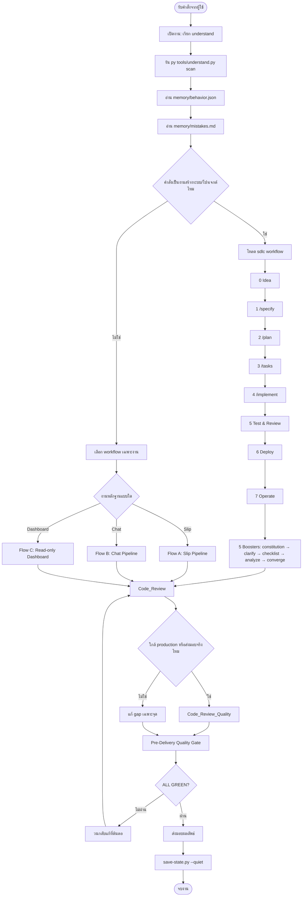
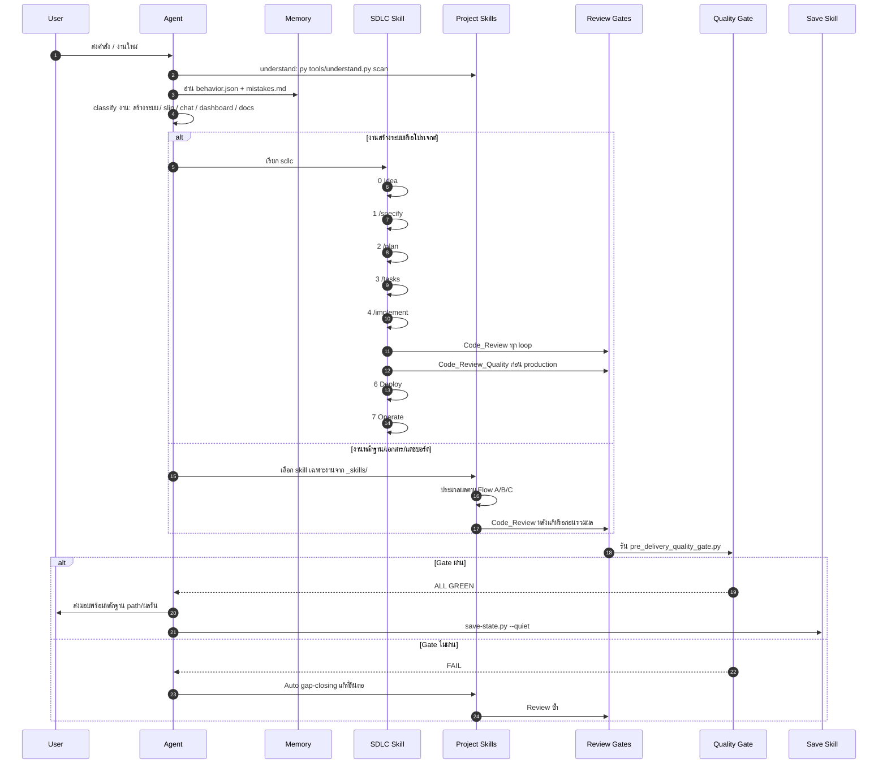
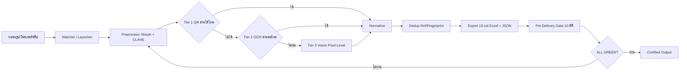
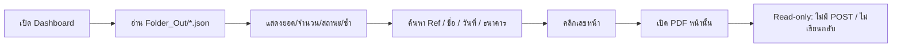
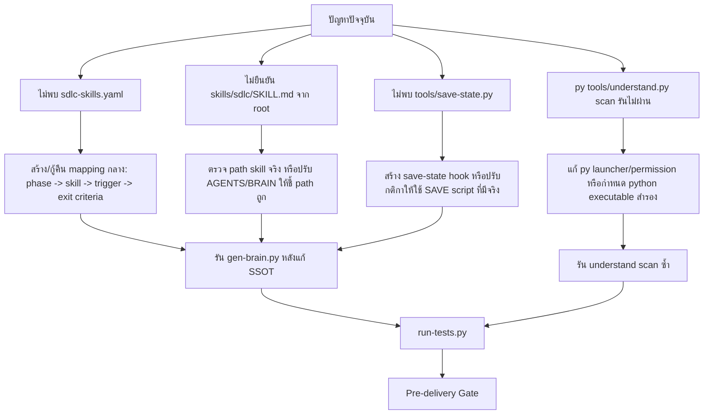

# 08 · SKILL WORKFLOW DIAGRAM — ลำดับการทำงานและจังหวะเรียกใช้สกิล

> อ้างอิงจริงจาก `AGENTS.md`, `BRAIN.md`, `Docs/TH/03-ARCHITECTURE.md`, `Docs/TH/05-SYSTEM-FLOW.md`  
> สถานะตรวจพบ: ยังไม่พบไฟล์ `sdlc-skills.yaml` ที่ root แม้ `AGENTS.md` ระบุให้ใช้เป็นสารบัญกลางของสกิลต่อขั้น

## 1. Executive Verdict

ลำดับการทำงานหลักถูกวางไว้ถูกทิศทางแล้ว: เริ่มจาก Understand/Memory → เดิน SDLC เมื่อเป็นงานสร้าง → ทำงานตาม pipeline หลัก → Review/Gate → Save state

จุดที่ "ถูกเวลา":
- `understand` ต้องมาก่อนงานทุกครั้ง เพื่อ scan + โหลด `memory/behavior.json` และ `memory/mistakes.md`
- `sdlc` ต้องเริ่มเมื่อคำแชทเป็นงานสร้างระบบ/โปรเจกต์
- `Code_Review` ต้องมาก่อน `Code_Review_Quality`
- `pre_delivery_quality_gate.py` ต้องเกิดก่อนส่งมอบ artifact
- `save-state.py --quiet` ต้องเกิดท้ายงาน/ท้ายสนทนา

จุดที่ "ยังไม่ครบ":
- `sdlc-skills.yaml` ไม่พบใน root ปัจจุบัน จึงยังตรวจไม่ได้ว่าแต่ละ SDLC phase map ไปสกิลใดแบบ SSOT
- `skills/sdlc/SKILL.md` และ `skills/understand/SKILL.md` ถูกอ้างในกติกา แต่ยังไม่พบในรายการไฟล์ root ที่ตรวจในรอบนี้
- คำสั่ง `py tools/understand.py scan` รันไม่ผ่านในรอบตรวจนี้ เพราะ `py.exe` ถูกระบบปฏิเสธการเข้าถึง ต้องแก้ runtime/permission ก่อนถือว่า gate นี้ผ่านจริง
- `tools/save-state.py` ถูกอ้างเป็น save hook ท้ายงาน แต่ไฟล์นี้ยังไม่อยู่ใน workspace ปัจจุบัน จึงต้องสร้าง hook หรือปรับกติกาให้ตรงกับกลไก SAVE จริง

## 2. ภาพรวมลำดับการทำงานของ Agent



## 3. ลำดับการเรียกใช้สกิลตามเวลา



## 4. Pipeline หลักของ DIGITAL_EVIDENCE

### Flow A — Slip



### Flow B — Chat

```mermaid
flowchart LR
    A[หย่อนแชท 3 โฟลเดอร์] --> B[List_names group + sort]
    B --> C[Dicut_Chat Streaming Canvas]
    C --> D[Slice QuietZone 1.30x]
    D --> E[Dedup Rule14]
    E --> F[Block-Fit + Zoom]
    F --> G[Generate PDF ด้วย PyMuPDF]
    G --> H[Search_Slip Hook]
    H --> I[10-col Index + JSON/XLSX]
    I --> J[Assembly Cover + Index แยกเล่ม]
    J --> K[Hash Cert]
    K --> L[Pre-Delivery Gate]
    L --> M{ALL GREEN?}
    M -- ไม่ผ่าน --> C
    M -- ผ่าน --> N[Certified Master]
```



### Flow C — Dashboard



## 5. Timing Matrix: เรียกใช้สกิลถูกเวลาไหม

| จังหวะ | Skill / Gate ที่ควรเรียก | สถานะจากไฟล์จริง | Verdict |
|---|---|---|---|
| เปิดงานทุกครั้ง | `understand` + `memory` | `AGENTS.md` และ `BRAIN.md` ระบุชัด | ถูกเวลา แต่รอบนี้รัน `py` ไม่ผ่าน |
| หลังอ่าน memory | Classify intent | มี rule งานสร้าง/งานอัตโนมัติ/Notebook/Deploy | ถูกเวลา |
| งานสร้างระบบ | `sdlc` | ระบุ workflow 8 ขั้น | ถูกเวลา แต่ขาด `sdlc-skills.yaml` ให้ตรวจ mapping |
| ระหว่าง implement | Project skills ใน `_skills/` / `_engines/` | `03-ARCHITECTURE.md` ระบุ source skills หลัก | ถูกเวลา |
| ทุก loop สำคัญ | `Code_Review` | `AGENTS.md` ระบุเร็วทุก/ทุกรอบ | ถูกเวลา |
| ก่อน production | `Code_Review_Quality` | `AGENTS.md` ระบุหลัง `Code_Review` และก่อน production | ถูกเวลา |
| ก่อนส่งมอบ | `pre_delivery_quality_gate.py` | ระบุทั้ง `AGENTS.md`, architecture, system-flow | ถูกเวลา |
| Gate fail | Auto gap-closing แล้ววนกลับ | `05-SYSTEM-FLOW.md` ระบุ needs_review → processing | ถูกเวลา |
| ท้ายงาน | `save` / `save-state.py --quiet` | ระบุใน `AGENTS.md`, `BRAIN.md`, architecture แต่ไฟล์ `tools/save-state.py` ยังไม่พบจริง | ถูกเวลาเชิงกติกา แต่ยัง execute ไม่ได้ |

## 6. จุดเสี่ยงที่ต้องแก้เพื่อให้ลำดับสกิลตรวจสอบได้ 100%



## 7. Recommended Skill Mapping ที่ควรมีใน `sdlc-skills.yaml`

> ส่วนนี้เป็นข้อเสนอเติม gap ไม่ใช่ข้อเท็จจริงจากไฟล์ เพราะยังไม่พบ `sdlc-skills.yaml`

| SDLC Phase | Skill ที่ควร map | Trigger | Exit Criteria |
|---|---|---|---|
| 0 Idea | `understand`, `memory` | เริ่มงาน | รู้ scope, ข้อห้าม, mistake rules |
| 1 /specify | `sdlc`, `librarian` ถ้ามีเอกสาร | งานสร้าง/แก้ระบบ | Requirement ชัด, no assumption |
| 2 /plan | `ask-senior` หรือ `quality-senior-agent` | งานซับซ้อน/เสี่ยง | มีแผน atomic + test plan |
| 3 /tasks | `sdlc` | หลัง plan | แตก task วัดผลได้ |
| 4 /implement | skill เฉพาะงานใน `_skills/` | เริ่มแก้จริง | โค้ด/เอกสารตรง scope |
| 5 Test & Review | `Code_Review`, `Code_Review_Quality` | หลัง implement | Findings ปิดแล้ว, regression ผ่าน |
| 6 Deploy | deploy/hotfolder ตามบริบท | งานต้อง publish/operate | deploy หรือ hotfolder rule พร้อมใช้งาน |
| 7 Operate | `save`, `memory` | จบงาน/เกิด error | checkpoint + mistakes/preference update |

## 8. สรุปใช้งานจริง

ลำดับที่ควรใช้เป็นมาตรฐาน:

```text
understand → memory → classify → sdlc/project-skill → implement/process
→ Code_Review → Code_Review_Quality เฉพาะก่อน production
→ pre_delivery_quality_gate → auto-fix loop จน ALL GREEN
→ ส่งมอบ → save-state
```

สถานะปัจจุบัน:

```text
ลำดับหลัก: ผ่านเชิงออกแบบ
จังหวะเรียกสกิล: ถูกหลัก
หลักฐาน mapping ต่อ phase: ยังไม่ครบ เพราะไม่พบ sdlc-skills.yaml
gate แรก understand: ยังไม่ผ่านจริง เพราะ py.exe ถูกปฏิเสธการเข้าถึงในรอบตรวจนี้
save hook ท้ายงาน: ยัง execute ไม่ได้ เพราะไม่พบ tools/save-state.py
```
