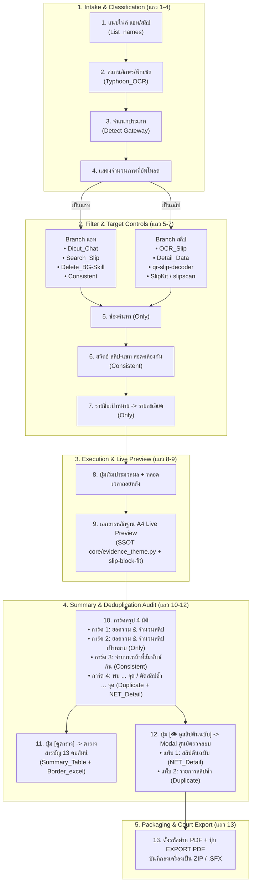

# Digital Evidence System Flow Implementation Plan

> **For agentic workers:** REQUIRED SUB-SKILL: Use superpowers:subagent-driven-development (recommended) or superpowers:executing-plans to implement this plan task-by-task. Steps use checkbox (`- [ ]`) syntax for tracking.

**Goal:** Implement and synchronize the complete end-to-end System Flow pipeline based on `System Flow.pdf`, connecting user interactions (UI components 1 to 13) with the backend forensic skills taxonomy (`Detect`, `Dicut_Chat`, `OCR_Slip`, `Consistent`, `Only`, `Duplicate`, `NET_Detail`, `Summary_Table`, etc.).

**Architecture:** Event-driven modular pipeline. File intake routes images through `Detect` gateway to specialized branch pipelines (`TYPE_CHAT` vs `TYPE_SLIP_SOLO` vs `TYPE_CHAT_WITH_SLIP`). Processed artifacts update reactive live preview stage, 4-card summary stats, deduplication audit matrix, and court-ready SFX/PDF exports.

**Tech Stack:** Vanilla HTML5/CSS3/ES6 (Glassmorphism UI), Python 3 standard library + OpenCV/Pillow, OpenTyphoon/EMVCo QR engines.

---

## Global Constraints
- Strictly adhere to `System Flow.pdf` component mapping (Rows 1 to 13) verbatim.
- Zero Double-Counting: Net actual amount must always exclude duplicate slips.
- Glassmorphism Visual Contract: Translucent panels over `Untitled-1.png` background, no nested double blurs.
- Standalone runnable: Single-click/browser runnable without external server dependencies.

---

## Flow Architecture Breakdown (Mapped from System Flow.pdf)

---

## Tasks

### Task 1: Image Intake, Auto-Detection & Branch Dispatching (แถว 1-4)
**Files:**
- Modify: `UI_WIREFRAME_PROTOTYPE_v2.html`
- Integration: `_skills/Detect/scripts/detect_classifier.py`, `_skills/List_names/scripts/list_names.py`

**Interfaces:**
- Consumes: File drop / selection event from dropzone.
- Produces: `detectedFiles: [{file, type: 'CHAT' | 'SLIP', pageIndex}]` and updates upload counter badge.

- [ ] **Step 1:** Bind dropzone to run intake analysis: count uploaded files, sort natural names via `List_names` logic.
- [ ] **Step 2:** Trigger `Detect` classifier to identify `TYPE_CHAT` vs `TYPE_SLIP_SOLO` vs `TYPE_CHAT_WITH_SLIP`.
- [ ] **Step 3:** Update upload chip with file count and classification breakdown badge.

---

### Task 2: Search, Target Filtering & Corroborated Switch (แถว 5-7)
**Files:**
- Modify: `UI_WIREFRAME_PROTOTYPE_v2.html`
- Integration: `_skills/Only/scripts/name_filter.py`, `_skills/Consistent/scripts/correlate_evidence.py`

**Interfaces:**
- Consumes: Search input string, Consistent checkbox toggle, Target card clicks.
- Produces: Filtered evidence stream and synchronized stats on Card 2 & Card 3.

- [ ] **Step 1:** Wire search input with prefix-stripping rule ("นาย/นาง/นางสาว/น.ส./คุณ") from `Only` skill.
- [ ] **Step 2:** Wire `สลิป-แชท สอดคล้องกัน` toggle to activate `Consistent` filter (cuts uncorroborated pages).
- [ ] **Step 3:** Update target cards to dynamically reflect target-specific transaction count and sub-totals.

---

### Task 3: Processing Countdown Timer & Live Stage A4 Synchronizer (แถว 8-9)
**Files:**
- Modify: `UI_WIREFRAME_PROTOTYPE_v2.html`
- Integration: `core/evidence_theme.py`, `_skills/slip-block-fit`

**Interfaces:**
- Consumes: `startProcessing()` click.
- Produces: Real-time countdown timer tick, circular SVG progress, dynamic page rendering.

- [ ] **Step 1:** Enhance `startProcessing()` with active countdown timer `00:02:18` descending and progress bar 0% -> 100%.
- [ ] **Step 2:** Implement seamless switching between CHAT mode (warm beige LINE chat) and SLIP mode (Forensic Slip Voucher) based on header toggle.
- [ ] **Step 3:** Ensure A4 footer disclaimer is strictly preserved as required by legal guidelines.

---

### Task 4: 4-Card Forensic Summary & Deduplication Modal (แถว 10-12)
**Files:**
- Modify: `UI_WIREFRAME_PROTOTYPE_v2.html`
- Integration: `_skills/Duplicate/scripts/duplicate_audit.py`, `_skills/NET_Detail/scripts/net_detail_calc.py`

**Interfaces:**
- Consumes: Processed evidence dataset.
- Produces:
  - Card 1: Gross Ledger Sum & Total Slips.
  - Card 2: Target-specific Sum & Slips.
  - Card 3: Corroborated Linked Pages Count.
  - Card 4: Net Master Slips vs Excluded Duplicate Count ("พบในสำนวน ... จุด / ตัดสลิปซ้ำออก ... จุด").
  - Modal: Tab 1 (Master Slips), Tab 2 (Duplicate Audit Table), Tab 3 (13-Column Ledger).

- [ ] **Step 1:** Verify Card 4 text matches exact specification: `พบในสำนวน 28 จุด / ตัดสลิปซ้ำออก 12 จุด`.
- [ ] **Step 2:** Connect `[👁 ดูสลิปต้นฉบับ]` button to open Modal directly to Tab 1 (`paneMaster`) with Tab 2 (`paneDuplicate`) clickable.
- [ ] **Step 3:** Connect `[ดูตารางสรุปทั้งหมด >]` button to open Modal Tab 3 (`paneLedger`).

---

### Task 5: Password-Protected PDF & Self-Extracting Archive (.SFX) Export (แถว 13)
**Files:**
- Modify: `UI_WIREFRAME_PROTOTYPE_v2.html`

**Interfaces:**
- Consumes: `pdfPasswordInput` and `exportCourtPdf()`.
- Produces: Simulated packaged court dossier download prompt (`.zip / .sfx`).

- [ ] **Step 1:** Validate password input with toggle reveal eye icon.
- [ ] **Step 2:** Wire `EXPORT PDF ส่งศาล` button to trigger Step 4 completed state and notify user of court dossier generation.

---

## Verification Plan

### Manual Verification
1. Open `UI_WIREFRAME_PROTOTYPE_v2.html` in browser.
2. Verify all 13 rows of `System Flow.pdf` are physically present and functionally active on screen.
3. Switch Mode CHAT ↔ SLIP to verify center A4 sheet renders both evidence forms correctly.
4. Click `[👁 ดูสลิปต้นฉบับ]` to verify Tab 1 (16 Master Slips) and Tab 2 (12 Duplicate Slips).
5. Click `[ดูตารางสรุปทั้งหมด >]` to verify 13-Column Court Ledger.
