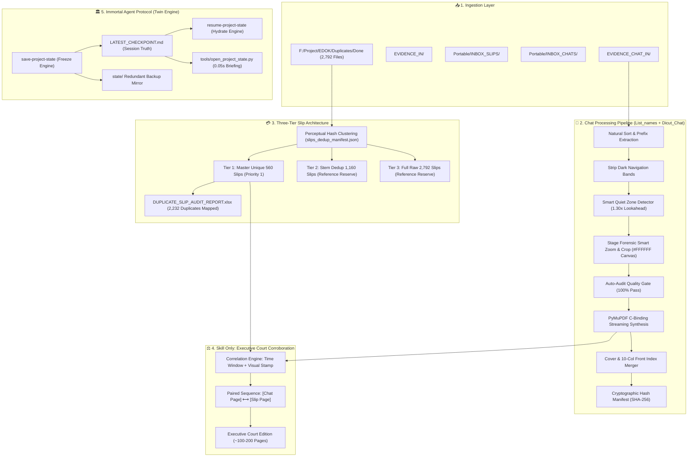

<!-- ============================================================================== -->
<!-- 🔄 SYSTEM DATA FLOW ARCHITECTURE & BUSINESS CONSTRAINTS                      -->
<!-- 👤 ROLE: SENIOR FULL-STACK DEVELOPER AGENT                                     -->
<!-- 📦 PROJECT: DIGITAL_EVIDENCE                                                   -->
<!-- 🌐 LANGUAGE: 🇺🇸 100% ENGLISH SPECIFICATION (OPTIMIZED FOR AI CONTEXT WINDOW)  -->
<!-- 📅 UPDATED: 2026-09-14T23:45:00+07:00                                          -->
<!-- ============================================================================== -->

# 🔄 SYSTEM DATA FLOW & INTERACTION ARCHITECTURE — DIGITAL_EVIDENCE

> **Operational Purpose:** This specification provides an exhaustive, end-to-end technical blueprint of the execution flow, system interaction nodes, and programmatic constraints governing the `DIGITAL_EVIDENCE` suite. Designed specifically to grant subsequent coding agents deterministic context inheritance under the strict constitutional Honesty Rule (Zero-Guessing / Zero-Hallucination), Stage Forensic Smart Zoom & Crop, Universal 18-Bank Coverage, Cryptographic Hash Manifests, and the Three-Tier Slip Architecture.

---

## 🧭 1. ⚙️ Step-by-Step Data Pipeline

```
 [STAGE 1: Multi-Channel Ingestion & Polling]
       │
       ▼
 [STAGE 2: Prefix Parsing & Natural Numeric Sorting (List_names)]
       │
       ▼
 [STAGE 3: Image Sanitization & Mobile Edge Band Removal]
       │
       ▼
 [STAGE 4: Quiet Zone Lookahead Slicing (Dicut_Chat)]
       │
       ▼
 [STAGE 5: Forensic Smart Zoom & Pure White Canvas Engine]
       │   ├── Stage 1: Container Penetration (A4 / Outer Border Stripping)
       │   ├── Stage 2: Mobile UI & Dark Bar Elimination (Micro-trim 2px)
       │   └── Canvas: Pure White (#FFFFFF) 900px Vertical Zoom (Zero Grey Gutter)
       │
       ▼
 [STAGE 6: Forensic Quality Gate & High-Speed PyMuPDF C-Binding Assembly]
       │
       ├──► [STAGE 7A: Executive Dossier & Front Index Merger (generate_cover_page)]
       │          ├── Page 1: Portrait Dossier Cover with Evidence Ribbon
       │          ├── Pages 2-5: 10-Column Landscape Slip Index with Gold Highlights
       │          └── Fast C-Binding Stream Stitching: 2,562 Pages in 6.81s
       │
       ├──► [STAGE 7B: Cryptographic Evidence Hash Certification (evidence_hash_manifest)]
       │          ├── SHA-256 + MD5 64KB Binary Streaming
       │          ├── Certificate Synthesis: EVIDENCE_HASH_CERTIFICATE.pdf
       │          └── Legal Manifest: EVIDENCE_HASH_MANIFEST.sha256 & .json
       │
       ├──► [STAGE 7C: Universal 18-Bank Slip Engine with Forensic Auditor (OCR_Slip)]
       │          ├── Pre-processing: Morphological Background Subtraction + CLAHE
       │          ├── QR Cryptographic Parser: EMVCo Tag 02 (Ref ID) + Tag 00/01 (BOT Code)
       │          ├── Text Engine: Local Tesseract (tha+eng) Multi-Pass OCR
       │          ├── Normalization: Thai Ligature Whitespace Stripping
       │          ├── SSOT Master Dictionary: 18 Thai Financial Institutions
       │          ├── Metadata Enrichment: Bank Branch (สาขา) Extraction into Memo
       │          ├── Three-Tier Architecture:
       │          │     ├── Tier 1 (Priority 1): Master Unique 560 Slips (1.54M THB)
       │          │     ├── Tier 2 (Reference): Stem Dedup 1,160 Slips
       │          │     └── Tier 3 (Reference): Full Raw 2,792 Slips
       │          └── Duplicate Auditor: DUPLICATE_SLIP_AUDIT_REPORT.xlsx (2,232 mapped)
       │
       └──► [STAGE 7D: Correlated Evidence Engine (Skill Only / only-corroborated)]
                  ├── Visual Stamp & Time-Window Matching
                  ├── Smoking Gun Pairing: [Chat Order] ⟷ [Bank Slip]
                  └── Executive Court Edition: ~100-200 Pages High-Impact Dossier
```

---

## 🗺️ 2. 🌐 System Interaction Map (Mermaid Architecture)



---

## 🔒 3. ⚖️ Business Logic Constraints & Forensic Audit Specifications

### 3.1 Stage Forensic Smart Zoom & Crop Standard
- **Stage 1 (Container Stripping):** Discards extreme 3px border noise, isolates inner active evidence bounding boxes, and punches through outer A4 containers or scanner margins.
- **Stage 2 (Mobile UI & Dark Bar Elimination):** Scans row brightness means across top and bottom regions, detecting mobile status/navigation bars (< 85 brightness). Employs 2px micro-trimming to eliminate hairline black seams.
- **Pure White Canvas Guarantee:** All standalone slips are placed on pure white (`#FFFFFF`) canvases scaled to `target_h = 900 px` (aspect ratio locked). The use of corner-median background fills on slips is strictly forbidden to prevent grey/slate border artifacts.

### 3.2 Three-Tier Slip Architecture & Duplicate Mapping
- **Tier 1 (Master Unique):** 560 verified unique slips ($1,547,803.68$ THB across 187 dates). Rendered into `Evidence_Slips_Master_Unique_560.pdf` (588 pages).
- **Audit Verification Mapping:** `DUPLICATE_SLIP_AUDIT_REPORT.xlsx` maps all 2,232 excluded duplicate files directly to their master counterpart with cluster verification status.
- **Tiers 2 & 3 (Reference Reserves):** 1,160 stem-dedup slips and 2,792 full raw files archived in `Folder_Out/Reference_Archives/` for historical audit preservation.

### 3.3 Skill Only (Executive Court Edition Protocol)
- Filters out non-transactional casual conversation pages.
- Correlates chat payment directives with actual bank transfer slips into consecutive paired pages.
- Reduces voluminous 2,500+ page chat files into a high-density, court-ready 100–200 page dossier.

### 3.4 Cryptographic Hash Manifest Standard (Section 26, 28)
- Every compiled master dossier is hashed via SHA-256 and MD5 using 64KB chunk binary streaming.
- Generates official `EVIDENCE_HASH_CERTIFICATE.pdf` and machine-verifiable `.sha256` manifests.

---

## 🛡️ 4. 🚨 Failure Recovery & Exception Handling Protocols

| Failure Mode | Trigger Condition | Deterministic Recovery Strategy |
| :--- | :--- | :--- |
| **High Page Count OOM** | Processing 500+ to 2,800+ pages simultaneously | Stream pages sequentially to tempfile disk images and compile via PyMuPDF C-Binding (`save_pdf_streaming`) |
| **Context Amnesia** | Agent opening new session / new chat turn | Ingest `LATEST_CHECKPOINT.md` via `tools/open_project_state.py` (0.05s) and resume exact previous state |
| **QR Code Unreadable** | Glare, compression artifacts, or partial crop | Fall back immediately to Multi-Pass OCR regex pattern matching (`202\d{15,19}`, `A[A-Za-z0-9]{14,21}`) |
| **Nested A4 Capture** | Phone screenshot pasted inside white document scan | Engage Stage 1 contour bounding box extraction followed by Stage 2 dark band stripping |

<!-- ============================================================================== -->
<!-- 🏁 END OF PROJECT_FLOW.md                                                     -->
<!-- ============================================================================== -->
