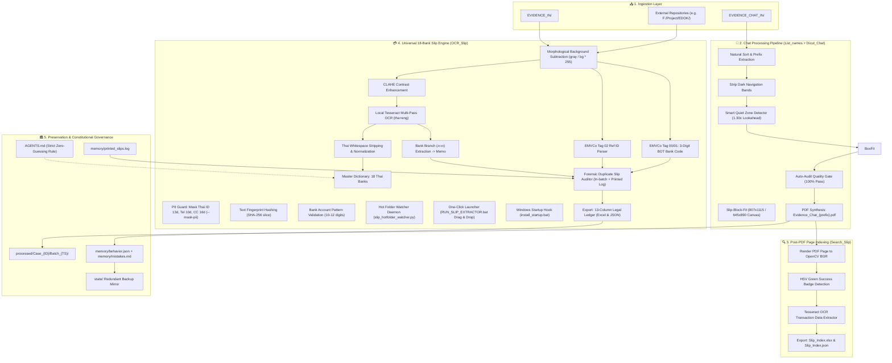

<!-- ============================================================================== -->
<!-- 🔄 SYSTEM DATA FLOW ARCHITECTURE & BUSINESS CONSTRAINTS                      -->
<!-- 👤 ROLE: SENIOR FULL-STACK DEVELOPER AGENT                                     -->
<!-- 📦 PROJECT: DIGITAL_EVIDENCE                                                   -->
<!-- 🌐 LANGUAGE: 🇺🇸 100% ENGLISH SPECIFICATION (OPTIMIZED FOR AI CONTEXT WINDOW)  -->
<!-- 📅 UPDATED: 2026-09-14T12:46:45+07:00                                          -->
<!-- ============================================================================== -->

# 🔄 SYSTEM DATA FLOW & INTERACTION ARCHITECTURE — DIGITAL_EVIDENCE

> **Operational Purpose:** This specification provides an exhaustive, end-to-end technical blueprint of the execution flow, system interaction nodes, and programmatic constraints governing the `DIGITAL_EVIDENCE` suite. Designed specifically to grant subsequent coding agents deterministic context inheritance under the strict constitutional Honesty Rule (Zero-Guessing / Zero-Hallucination), Universal 18-Bank Coverage, and Forensic Duplicate Slip Auditing.

---

## 🧭 1. ⚙️ Step-by-Step Data Pipeline

```
 [STAGE 1: Multi-Channel Ingestion & Polling]
       │
       ▼
 [STAGE 2: Prefix Parsing & Natural Numeric Sorting (List_names)]
       │
       ▼
 [STAGE 3: Image Sanitization & Mobile Edge Band Removal]
       │
       ▼
 [STAGE 4: Quiet Zone Lookahead Slicing (Dicut_Chat)]
       │
       ▼
 [STAGE 5: Slip-Block-Fit Dynamic Background Canvas Standardization]
       │
       ▼
 [STAGE 6: Forensic Quality Gate & PDF Assembly]
       │
       ├──► [STAGE 7A: Post-PDF Slip Detection & Page Indexing (Search_Slip)]
       │
       └──► [STAGE 7B: Universal 18-Bank Slip Engine with Forensic Auditor (OCR_Slip)]
                  ├── Pre-processing: Morphological Background Subtraction + CLAHE
                  ├── QR Cryptographic Parser: EMVCo Tag 02 (Ref ID) + Tag 00/01 (3-Digit BOT Bank Code)
                  ├── Text Engine: Local Tesseract (tha+eng) Multi-Pass OCR
                  ├── Normalization: Thai Ligature Whitespace Stripping
                  ├── SSOT Master Dictionary: 18 Thai Financial Institutions
                  ├── Metadata Enrichment: Bank Branch (สาขา) Extraction into Memo
                  ├── Forensic Audit: In-Batch & Cross-Batch Duplicate Slip Detection
                  ├── Grid Engine & Typography: Sarabun Font + 100% Center-Aligned Cells + 4-Sided Thin Borders
                  ├── Print Layout: A4 Landscape (1406x993 px) + Centered 3-Line Legal Disclaimer
                  └── Legal Ledger: 13-Column Excel (Warning Cell Highlighting) + JSON
```

---

## 🗺️ 2. 🌐 System Interaction Map (Mermaid Architecture)



---

## 🔒 3. ⚖️ Business Logic Constraints & Forensic Audit Specifications

### 3.1 Forensic Duplicate Slip & Printed Log Auditing
- **In-Batch Duplicate Detection:** Identifies repeated Transaction Reference IDs or identical filename stems within the same run. Marks repeated entries as `⚠️ สลิปซ้ำ (Ref ซ้ำกับ ลำดับ X)` and points to the original occurrence.
- **Cross-Batch Historical Verification:** Compares Ref IDs and filenames against `memory/printed_slips.log` (or external `printed_slips.txt`). Flags previously processed slips as `⚠️ เคยพิมพ์แล้ว (Printed)`.
- **Visual Evidence Warning:** In the Excel ledger, duplicate rows are styled with an amber background (`#FFF2CC`) and bold red font (`#C00000`) in Column 13 (`สถานะการตรวจสอบ`).

### 3.2 Bank Branch Extraction into Memo
- Scans OCR text for counter slip or ATM identifiers matching `(?:สาขา|Branch)[\s:]*([^\n\r,]+)`.
- Enriches the transaction `memo` field with `สาขา: [Branch Name]` without overwriting user-specified notes.

### 3.3 3-Digit BOT Financial Institution Code Standard
- In compliance with the Bank of Thailand (BOT) National QR Code Standard, embeds a 3-digit institutional code within `Tag 00 -> Sub-tag 01` of the EMVCo payload:
  - `002`: BBL, `004`/`005`: KBANK, `006`: KTB, `011`: TTB, `014`: SCB, `025`: BAY, `030`: GSB, `034`: BAAC, `066`/`069`: KKP, `024`: UOB, `022`: CIMB, `073`: LHBANK, etc.

### 3.4 Strict Zero-Guessing Rule (Constitutional Mandate)
- **Zero Tolerance for Hallucination:** Agents are strictly forbidden from guessing, inferring, or fabricating bank names, counterparty names, account numbers, or financial amounts.
- Distorted OCR tokens (e.g. `Alovdsuma`) MUST NOT be guessed phonetically. They MUST bind to proven ground-truth bank accounts (e.g. `996-5` binds strictly to TTB).

### 3.5 Standard Legal Grid & Typography Protocol (Chat Evidence Blueprint)
- **Strict Center Alignment:** Every data, numerical, and status cell MUST be center-aligned across both horizontal and vertical axes (`Alignment(horizontal='center', vertical='center', wrap_text=True)`). Left or right bias is explicitly prohibited.
- **Official Typography:** The table strictly employs the `Sarabun` font family (`Sarabun` 16pt bold for Title, 12pt bold for Headers, 11pt regular for Data cells, 9pt for Disclaimer).
- **Full Perimeter Borders:** Every active cell is bounded by 4-sided crisp thin borders (`Border(left=thin, right=thin, top=thin, bottom=thin)`).
- **A4 Landscape Dimensions:** Formatted for A4 Landscape printing ($1406 \times 993$ px, `orientation=landscape`, `paperSize=9`), with margins (Top 157px, Bottom 179px, Left/Right 102px).
- **Centered Disclaimer Footer:** A 3-line legal disclaimer is merged and centered at the bottom of the ledger:
  `"DIGITAL EVIDENCE เป็นเพียงการเครื่องมืออำนวยความสะดวกให้กับผู้ว่าจ้าง โดยไม่ได้ดัดแปลง แก้ไข เพิ่ม-ลบ เนื้อหา\nจากต้นฉบับใดๆ และไม่มีส่วนเกี่ยวข้องใดๆกับเนื้อหาในเอกสาร เป็นเพียงเครื่องมือที่ทำงานเกี่ยวกับระบบไฟล์\nเอกสารแบบอิเล็กทรอนิกส์ เท่านั้น"`

---

## 🛡️ 4. 🚨 Failure Recovery & Exception Handling Protocols

| Failure Mode | Trigger Condition | Deterministic Recovery Strategy |
| :--- | :--- | :--- |
| **QR Code Unreadable** | Glare, compression artifacts, or partial crop | Fall back immediately to Multi-Pass OCR regex pattern matching (`202\d{15,19}`, `A[A-Za-z0-9]{14,21}`, `N\d{20,26}`) |
| **Thai Spacing Desync** | Tesseract inserts spaces between glyphs | Execute `t_clean = text.replace(' ', '').lower()` before regex evaluation |
| **Duplicate Detected** | Ref ID or filename matched in batch or historical log | Annotate in Column 13 with sequence reference, apply visual amber fill, and preserve both records for forensic comparison |
| **Unrecognized Bank** | Distorted OCR font not matching string patterns | Apply SSOT Account Mapping: Bind target recipient account numbers to bank entities |

<!-- ============================================================================== -->
<!-- 🏁 END OF PROJECT_FLOW.md                                                     -->
<!-- ============================================================================== -->
