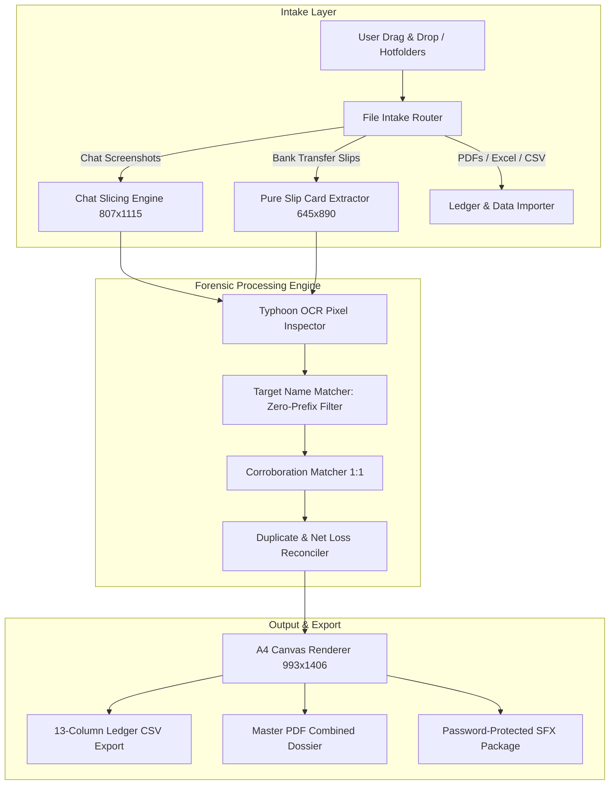

# PROJECT_FLOW - DIGITAL_EVIDENCE

Snapshot Date: 2026-09-26
Language: English

---

## 1. System Overview

`DIGITAL_EVIDENCE` is a professional forensic-grade digital evidence compilation and review system designed to convert chat screenshots, bank transfer slips, and financial transaction records into court-ready A4 dossiers complying with ISO/IEC 27037 standards and Thai Court Forensic Evidence rules.

---

## 2. System Architecture & Interaction Map

```mermaid
graph TD
    subgraph Intake Layer
        A[User Drag & Drop / Hotfolders] --> B[File Intake Router]
        B -->|Chat Screenshots| C1[Chat Slicing Engine 807x1115]
        B -->|Bank Transfer Slips| C2[Pure Slip Card Extractor 645x890]
        B -->|PDFs / Excel / CSV| C3[Ledger & Data Importer]
    end

    subgraph Forensic Processing Engine
        C1 --> D1[Typhoon OCR Pixel Inspector]
        C2 --> D1
        D1 --> D2[Target Name Matcher: Zero-Prefix Filter]
        D2 --> D3[Corroboration Matcher 1:1]
        D3 --> D4[Duplicate & Net Loss Reconciler]
    end

    subgraph Output & Export
        D4 --> E1[A4 Canvas Renderer 993x1406]
        E1 --> F1[13-Column Ledger CSV Export]
        E1 --> F2[Master PDF Combined Dossier]
        E1 --> F3[Password-Protected SFX Package]
    end
```

---

## 3. Data Processing Rules

1. **Pixel-Level Standard:** All text, dates, amounts, account numbers, and sender/receiver names are extracted directly from pixel data with zero guessing.
2. **Zero-Prefix Target Matching:** Thai prefixes (Mr., Mrs., Miss, Police/Military Ranks, Dr.) are automatically stripped before target association.
3. **Decoupled 1:1 Page Numbering:** The first content page is strictly Page 1, matching the physical printed court document.
4. **Official Disclaimer SSOT:** 3-line legal disclaimer is anchored at the base of every generated A4 sheet.
