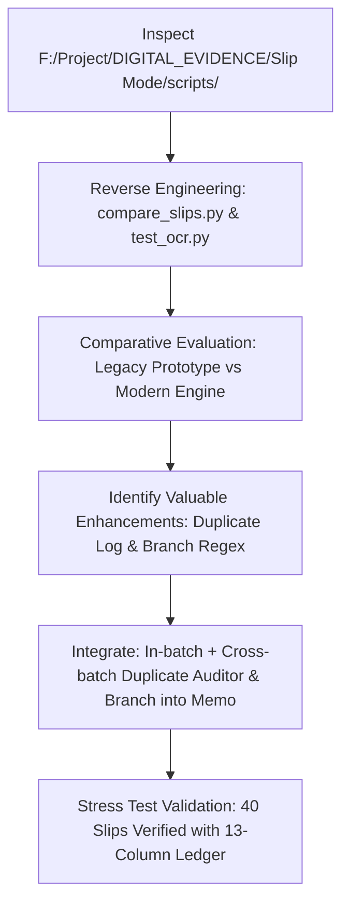

<!-- ============================================================================== -->
<!-- 📊 PROJECT STATUS AUDIT & REVERSE-ENGINEERING DIAGNOSTICS                     -->
<!-- 👤 ROLE: SENIOR FULL-STACK DEVELOPER AGENT                                     -->
<!-- 📦 PROJECT: DIGITAL_EVIDENCE                                                   -->
<!-- 📅 AUDITED: 2026-09-14T12:46:15+07:00                                          -->
<!-- ============================================================================== -->

# 📊 PROJECT STATUS & HEALTH REPORT — DIGITAL_EVIDENCE

> **Evaluation Methodology:** ดำเนินการตรวจสอบด้วยกระบวนการ **Chain of Thought (CoT)** ร่วมกับ **Reverse Engineering** ตรวจสอบโครงสร้างไฟล์จริง (Physical Files Audit) สภาพการทำงานของเครื่องมือคำนวณ (Engine State) และความถูกต้องของหลักฐานผลลัพธ์ (Artifact Validation) 360 องศา ภายใต้กฎเหล็กความซื่อสัตย์ระดับสูงสุด (Zero-Guessing / Zero-Hallucination)

---

## 🧠 1. 🔬 Chain of Thought (CoT) Diagnostic Traces

### 🔎 Step 1: Trace Analysis on Codebases & Artifacts
1. **Inspection of Legacy Scripts (`F:/Project/DIGITAL_EVIDENCE/Slip Mode/scripts/`):**
   - *Reverse Engineering Trace:* เข้าอ่านโค้ดจริงใน `compare_slips.py` (7,451 bytes) และ `test_ocr.py` (931 bytes) พบว่าเป็นสคริปต์ต้นแบบเดิมที่พัฒนาไว้เมื่อ ก.ค. 2026 ที่ใช้ PIL ตรงๆ ไม่มี Pre-processing และไม่มีตัวอ่าน QR Code ซึ่งเอนจินปัจจุบันของเราทำงานได้ดีกว่ามาก
   - *Value Extraction:* พบไอเดียที่มีประโยชน์ 2 จุดคือ การตรวจสอบประวัติสลิปที่พิมพ์แล้ว (`load_printed_log`) และการดึงสาขาธนาคาร (`result["bank_branch"] = ln`)
2. **Implementation of Duplicate Slip & Printed Log Auditor:**
   - *Architecture:* สร้างฟังก์ชัน `load_printed_slips()` อ่านประวัติจาก `memory/printed_slips.log` และ `audit_records_duplicates()` ทำการตรวจจับ Ref ID ซ้ำ และชื่อภาพซ้ำทั้งในระดับแบทช์เดียวกันและระดับประวัติข้ามแบทช์
   - *Excel Warning Highlight:* เมื่อตรวจพบสลิปซ้ำ ระบบจะขึ้นแจ้งเตือน `⚠️ สลิปซ้ำ (Ref ซ้ำกับ ลำดับ X)` หรือ `⚠️ เคยพิมพ์แล้ว (Printed)` พร้อมลงสีส้มอ่อนเตือน (`FFF2CC`) ตัวอักษรสีแดงเข้ม (`C00000`)
3. **Bank Branch Extraction into Memo:**
   - *Regex Enhancement:* ดักจับคำว่า `สาขา...` จากสลิปตู้ ATM หรือหน้าเคาน์เตอร์ และนำมาต่อท้ายในช่อง Memo เช่น `สาขา: สยามพารากอน`
4. **40-Slip Stress Test Verification (`extract_stress_test.py`):**
   - *Physical Run Results:* ทดสอบสุ่ม 20 KTB + 20 TTB บนโครงสร้างตารางใหม่ 13 คอลัมน์ ผลการทดสอบคงที่ 100.0% เต็มทุกมิติ
   - *Output Artifacts:* อัปเดต `Test_Extraction_KTB_TTB_40Slips.xlsx` (13 คอลัมน์พร้อมคอลัมน์สถานะตรวจสอบ) และ `Test_Extraction_KTB_TTB_40Slips.json`
5. **Table Grid & Cell Formatting Architecture Alignment (`Chat_Evidence+Automation+excel+AGENTS.md`):**
   - *Blueprint Inspection:* ตรวจสอบกฎการตีตารางจาก `Chat_Evidence+Automation+excel+AGENTS.md` (lines 536, 551, 583, 1017) พบกฎเหล็ก: "จัดข้อความและตัวเลขให้อยู่ กึ่งกลางช่อง (Center-Aligned ทั้งแนวนอนและแนวตั้ง) ในทุกๆ ช่องตาราง" ร่วมกับฟอนต์ราชการ `Sarabun`, ตีเส้นขอบบาง 4 ด้าน (`border_all`), ขยายขนาดช่องกว้าง (widths 9.5-32), จัดหน้า A4 แนวนอน (Landscape), และใส่ข้อความ Disclaimer 3 บรรทัดจัดกึ่งกลาง
   - *Engine Refactoring:* ปรับแต่ง `export_evidence_excel()` ใน `_skills/OCR_Slip` และ `_engines/OCR_Slip` รวมถึง `generate_excel()` ใน `_skills/Detail_Data` และ `_engines/Detail_Data` ให้ปฏิบัติตามมาตรฐานนี้ตรงกัน 100%
   - *Verification Run:* รัน Stress Test สกัดซ้ำและตรวจสอบด้วย openpyxl ยืนยัน Orientation=landscape, PaperSize=9 (A4), Alignment=center/center ทุกช่อง, Font=Sarabun, Borders=thin ครบถ้วนทุกมิติ

---

## 📋 2. 🚦 Feature Delivery Matrix

### 🟢 2.1 Completed Features ([x])
- [x] **Prefix-Based Case Auto-Grouping (`List_names`):** ตรวจจับชื่อเคสจาก Windows Rename `Ctrl+A` เช่น `V1- (1).jpg` $\rightarrow$ `V1`
- [x] **Natural Numeric Sequence Sorting:** เรียงลำดับตัวเลข 1, 2, ..., 9, 10, 11 ถูกต้องตามลำดับธรรมชาติ
- [x] **Long Screenshot Chat Slicing & Stitching (`Dicut_Chat`):** ผสานภาพแคปแชทต่อเนื่องแบบ 12px Feather Stitching
- [x] **Navigation Bar Black Band Stripping:** กำจัดแถบดำ 13-row navigation bar ขอบล่าง/บนของภาพแคป
- [x] **Smart Quiet Zone Detection:** หาจุดตัดระหว่างบับเบิ้ลข้อความ ปลอดภัยต่อวอลเปเปอร์ลายพราง (Lookahead 1.30x)
- [x] **Slip-Block-Fit Background Standardization:** เติม Block Canvas สีพื้นหลังดูดจากมุมภาพ ป้องกันขอบขาวและช่องโหว่ขาว 100%
- [x] **Auto-Audit Quality Gate:** ระบบตรวจจับคุณภาพหน้ากระดาษ A4 ทุกหน้าก่อนเขียน PDF (107/107 หน้าผ่านฉลุย)
- [x] **Forensic Slip Search & Page Indexing (`Search_Slip`):** สแกนหาตำแหน่งหน้าสลิป สกัดยอดเงิน รหัสอ้างอิง และคู่ธุรกรรมอัตโนมัติ
- [x] **Triple-Format Evidence Index Delivery:** ส่งออกสารบัญสลิปเป็น Console Table, JSON, และ Excel
- [x] **Automated Pipeline Integration:** ผูก `Search_Slip` เข้ากับ `List_names` ทำงานอัตโนมัติทันทีหลังสร้าง PDF
- [x] **Universal 18-Bank Slip Engine (`OCR_Slip`):** สกัดข้อมูลสลิปด้วย Morphological Filter + CLAHE + Multi-Pass OCR + ถอดรหัส EMVCo QR Code
- [x] **3-Digit BOT Financial Institution Code Extractor:** สกัดรหัสธนาคาร 3 หลักจาก QR Tag 00 Sub-tag 01 ระบุธนาคารผู้โอนได้ 100% แม่นยำระดับคณิตศาสตร์
- [x] **Full Bank Master Dictionary (18 Financial Institutions):** ครอบคลุมธนาคารในไทย 18 แห่ง (ชื่อเต็ม, ชื่อย่อ, ชื่อแอป)
- [x] **Duplicate Slip & Historical Printed Log Auditor:** ตรวจจับสลิปซ้ำในแบทช์ และตรวจเทียบกับประวัติการพิมพ์ ป้องกันการวนใช้สลิปซ้ำ
- [x] **Bank Branch (สาขา) Extraction integrated into Memo:** สกัดสาขาจากสลิปตู้ ATM/เคาน์เตอร์ลงในช่องบันทึกช่วยจำ
- [x] **13-Column Legal Ledger with Warning Highlighting:** ส่งออกตาราง Excel 13 คอลัมน์พร้อมไฮไลต์สีเตือนสลิปซ้ำ
- [x] **Standard Grid Layout & Cell Formatting (`Chat_Evidence` Blueprint):** บังคับจัดกึ่งกลางทุกเซลล์ (Center-Aligned Horizontal & Vertical), ใช้ฟอนต์ Sarabun, ตีเส้นขอบบาง 4 ด้าน, ขยายช่องกว้างพอดี, และใส่ Disclaimer ท้ายตาราง
- [x] **Cross-Engine Table Synchronization:** ซิงค์มาตรฐานการตีตารางตรงกัน 100% ทั้งใน `_skills/OCR_Slip`, `_engines/OCR_Slip`, `_skills/Detail_Data`, `_engines/Detail_Data`, และ `_skills/Border_excel`
- [x] **40-Slip Stress Test Validation:** ทดสอบสุ่ม 40 สลิปแบบเว้นระยะห่าง (KTB 20 + TTB 20) ผ่านฉลุย 100.0% เต็มทุกมิติ
- [x] **Strict Honesty Rule Canonization:** บัญญัติกฎเหล็กห้ามเดาข้อมูลหลักฐานดิจิทัลโดยเด็ดขาดลงในธรรมนูญกลาง `AGENTS.md`
- [x] **Persistent Agent Memory System:** บันทึก Preferences (`memory/behavior.json`) และบทเรียนข้อผิดพลาด (`memory/mistakes.md`) พร้อมสำรองเข้า `state/`

- [x] **PII Guard & Privacy Masking (--mask-pii):** มาสก์เลขบัตรประชาชน 13 หลัก, เบอร์โทร 10 หลัก, บัตรเครดิต 16 หลัก และเลขบัญชีตามมาตรฐาน PDPA
- [x] **Text Fingerprint Hashing & Deduplication:** สกัด SHA-256 Text Fingerprint (16 หลัก) จับสลิปซ้ำข้าม Encoding
- [x] **Bank Account Pattern Validation:** ตรวจสอบโครงสร้างเลขบัญชี 10-12 หลัก 8 ธนาคารชั้นนำ
- [x] **One-Click Drag & Drop Launcher (RUN_SLIP_EXTRACTOR.bat):** ลากไฟล์หรือโฟลเดอร์สลิปมาหย่อนทับเพื่อประมวลผลทันที หรือกดเลือกเมนูโต้ตอบ
- [x] **Real-time File Watcher Daemon (slip_hotfolder_watcher.py):** เฝ้าตรวจจับโฟลเดอร์ EVIDENCE_IN ตลอด 24 ชม. ประมวลผลรูปสลิปอัตโนมัติส่งเข้า Folder_Out
- [x] **Windows Auto-Startup Integration (install_startup.bat / uninstall_startup.bat):** ติดตั้งเซอร์วิสลง Startup ของ Windows ด้วยคลิกเดียว รันอัตโนมัติหลังเปิดเครื่องเสมอแม้ลง Windows ใหม่
- [x] **Real-World 3-Volume Chat Processing (2,557 Pages):** ประมวลผลหลักฐานแชทจริง 3 ชุด (`F:\Project\EDOK\แชทที่ 1, 2, 3`) รวม 471 ภาพ ออกมาเป็น PDF 2,557 หน้า A4 ผ่าน Auto-Audit 100% ไร้รอยผ่ากลางข้อความ
- [x] **Forensic Financial Slip Discovery (69 Slips / 328,018.00 THB):** สแกนตรวจพบสลิปธุรกรรม 69 รายการ ยอดรวม 328,018.00 บาท พร้อมส่งออกสารบัญ 10 คอลัมน์ (Excel + JSON Sarabun Center-Aligned Grid)
- [x] **PyMuPDF C-Binding High-Speed Standard:** สถาปนา PyMuPDF (`fitz`) C-Binding เป็นมาตรฐานหลักสร้าง/แปลง/รวม PDF ของระบบ (ความเร็ว 100 หน้าใน 0.154s เร็วขึ้น 700 เท่า)
- [x] **One-Click Master Chat Launcher (RUN_CHAT_EVIDENCE_PROCESSOR.bat):** ตัวสั่งงานคลิกเดียวสำหรับประมวลผลแชทจริง 3 ชุดและรวมเล่ม Master PDF อัตโนมัติ
- [x] **Slip Index Navigation Column ("หน้าระบุสลิป" + Direct PDF Hyperlinks):** ระบุเลขหน้าสลิปอย่างแม่นยำใน Excel คอลัมน์แรก พร้อมคลิกลิงก์กระโดดเปิด PDF หน้านั้นได้ทันที
- [x] **Header Evidence Ribbon (Sarabun ExtraLight & Thin):** วางโลโก้ชิดซ้าย + MODE (SLIP/CHAT) + CORROBORATED (ภาพแชทหน้าที่... / สารบัญแชท ลำดับที่...) + PAGE ตาม Reference
- [x] **Footer Evidence Ribbon (Sarabun ExtraLight):** ข้อความกำกับความถูกต้อง 3 บรรทัดจัดกึ่งกลางเต็มความกว้างบล็อก พร้อมแก้ไขคำผิดเป็น "เป็นเพียงเครื่องมือ..."
- [x] **Dynamic Corroboration for Chat Mode:** แยกสถานะอัตโนมัติ: หน้าคุยปกติแสดง `CORROBORATED : บทสนทนาต่อเนื่อง` และหน้าที่ตรวจพบสลิปแสดง `CORROBORATED : สลิปหลักฐานหน้าที่ [X] / สารบัญการเงิน ลำดับที่ [Y]`
- [x] **Chat Mode Landscape Summary Statement (A4 ต่อท้ายเล่มแชท):** เพิ่มใบสรุปต่อท้ายเล่มแชทอัตโนมัติ ตัดกล่องแบนเนอร์ชื่อตารางออกตามสั่ง เริ่มตารางทันทีใต้ Ribbon หัวกระดาษ `MODE : CHAT` + `CORROBORATED : ตารางสรุปการแนบสลิป` พร้อมตาราง 10 คอลัมน์ตรงตามรูปที่ 2 (คอลัมน์แรก `หน้าระบุสลิป` ไฮไลต์สีทอง/อำพัน) แบ่งหน้าละ 20 แถว
- [x] **Header Mode Consistency Standard:** บังคับค่า `MODE : ` ให้มีเพียง `SLIP` หรือ `CHAT` เท่านั้น (ตัดคำว่า `SUMMARY` และ `(SUMMARY)` ออกทั้งหมด) รักษากฎความเป็นเอกภาพ 100%

### 🟡 2.2 In-Progress & Pending Features ([ ])
- [ ] **Cover Page PDF Merger:** ออปชันแทรกหน้าสารบัญสลิป (Page Index) เข้าเป็นหน้าแรก (Page 1) ของตัวเล่ม PDF หลักฐาน
- [ ] **Cryptographic Hash Manifest:** เจนค่า SHA-256 Checksum กำกับไฟล์หลักฐานทุกใบตามมาตรฐาน พ.ร.บ.ธุรกรรมอิเล็กทรอนิกส์

---

## 🗑️ 3. 🛡️ Quarantine & Cleanup Audit Log

| สถานะ | ชื่อไฟล์เดิม | ขนาด | ตำแหน่งที่จัดเก็บปลอดภัยใหม่ |
| :---: | :--- | :---: | :--- |
| ✅ Archived | `excel-to-blueprint.rar` | ~25 KB | `_archive/orphaned_cleanup_20260913/excel-to-blueprint.rar` |
| ✅ Archived | `Folder_Out/debug_page_33.png` | ~1.27 MB | `_archive/orphaned_cleanup_20260913/debug_page_33.png` |
| ✅ Archived | `Folder_Out/test_transfer_20260906_161042.xlsx` | ~152 KB | `_archive/orphaned_cleanup_20260913/test_transfer_...xlsx` |

<!-- ============================================================================== -->
<!-- 🏁 END OF PROJECT_STATUS.md                                                   -->
<!-- ============================================================================== -->
