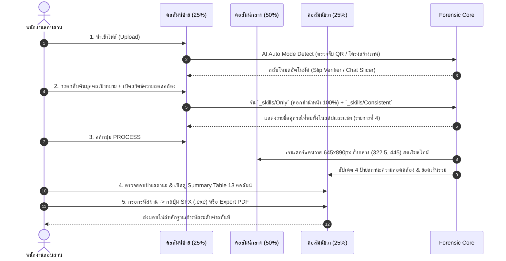

# 🏛️ SPECIFICATION_TEMPLATE-v2.md
## สเปกแม่แบบสถาปัตยกรรมหน้าเว็บแอปพลิเคชัน (v2.0)
### มาตรฐาน Dark Glassmorphism 6D Prism & 3-Column Working Grid (25% : 50% : 25%)

---

## 🎨 1. วิธีการออกแบบและโครงสร้างเลย์เอาต์หลัก (Architecture Methods)

### 1.1 โครงสร้าง 3 คอลัมน์ (25% - 50% - 25% Layout Ratio)
* **คอลัมน์ซ้าย (25% Width - Left Control Rail):** รวมศูนย์ปุ่มคำสั่ง และอินพุตป้อนข้อมูลทั้งหมด
  1. ปุ่ม 1. อัปโหลดไฟล์ (Drag & Drop + Auto AI Mode Detection)
  2. ช่อง 2. สืบค้นบุคคลเป้าหมาย (Zero-Prefix Stripping อัตโนมัติ 100% ผ่าน `_skills/Only`)
  3. สวิตช์ 3. ท็อกเกิลสืบค้นความสอดคล้อง (`_skills/Consistent`)
  4. แผง 4. รายชื่อที่พบทั้งในสลิปและแชท
  5. ปุ่ม 5. ประมวลผลหลักฐาน (PROCESS)
* **คอลัมน์กลาง (50% Width - Live Preview Sync Stage):** พื้นที่แสดงผลพรีวิวแคนวาสรายงานหลักฐานขนาด A4 สดเรียลไทม์
  * ผืนผ้าใบกระดาษมาตรฐาน A4 สเกลคงที่ **`645x890 px`**
  * พล็อตวางภาพหลักฐานทับจุดกึ่งกลางสมมาตร `(322.5, 445)` อย่างแม่นยำ 100% (Aspect Ratio Lock)
  * ป้ายกำกับบนหัวจอ `ชิ้นส่วนรายงานหน้า X / N`
  * โลโก้แบล็คกราวสเกล 1:1 ซ้อนที่ฉากหลัง (`z-index: 0`, `opacity: 0.10`)
  * ป้าย Footer Disclaimer 3 บรรทัดทางการก้นกระดาษ
* **คอลัมน์ขวา (25% Width - Feature Status & Exporter):** รวมศูนย์ป้ายบอกสถานะความสอดคล้อง สรุปยอด และปุ่มส่งออกไฟล์
  1. ป้ายที่ 1: สถานะสลิป-แชทสอดคล้อง (`_skills/Consistent`)
  2. ป้ายที่ 2: สถานะรายชื่อสอดคล้อง (`_skills/Only`)
  3. ปุ่ม 3: Summary Table (เปิดดูตาราง 13 คอลัมน์ Sarabun Center Grid)
  4. ป้ายที่ 4: สถานะสลิปไม่ซ้ำ Master (`DuplicateGuard`)
  5. ช่อง 5: พาสเวิร์ด (Single Password Input)
  6. ปุ่ม 6: SFX (บีบอัด WinRAR SFX .exe พร้อมคำประกาศปฏิเสธความรับผิดชอบ)
  7. ปุ่ม 7: Export (ดาวน์โหลด Master PDF Dossier ฉบับสมบูรณ์)

### 1.2 สไตล์ Dark Glassmorphism 6D Prism Design Tokens
* **โทนสีหลัก:** ฟ้า-เทา (Blue-Gray Dark Slate)
* **Canvas Background:** `#0F172A` / `#12243D`
* **Glass Surface:** `rgba(30, 41, 59, 0.60)`
* **Backdrop Filter:** `blur(16px)`
* **Specular Border:** `1px solid rgba(255, 255, 255, 0.12)`
* **Glass Glow Shadow:** `0 8px 32px 0 rgba(0, 0, 0, 0.37)`
* **Accent Sky Blue:** `#00A1E4` / `#38BDF8`
* **Failed / Alert Highlight:** `#FDE8E8` (พื้นหลังแดงอ่อน) / `#C53030` (ตัวอักษรแดงเข้ม)
* **Typography:** `Sarabun Light` (16px Body, 18-24px Headers) + `JetBrains Mono` (ตัวเลข/รหัสอ้างอิง)
* **Geometry:** Spacing 8-Point Grid / Border-Radius $\le 4\text{px}$

---

## 🔄 2. ขั้นตอนการประมวลผลและการทำงานของ UI (Step-by-Step Operations)

---

## ⚙️ 3. เงื่อนไขและระเบียบการควบคุม UI (System Conditions)

1. **เงื่อนไขสัดส่วนเลย์เอาต์:** ล็อกสัดส่วน **25% : 50% : 25%** บนหน้าจอ Desktop/Laptop เสมอ เพื่อให้สายตามุ่งเน้นที่เอกสารพยานตรงกลาง
2. **เงื่อนไขการวางกึ่งกลางบล็อก A4:** ท่อนแชทที่ถูกย่อตามสเกลเพื่อหลบขอบล่างบล็อก จะถูกจัดวางกึ่งกลางสมมาตร `(322.5, 445)` บนแคนวาส 645x890px โดยยินยอมให้เกิดช่องว่างสีพื้นหลังแชทเฉพาะที่ขอบฝั่งซ้ายและขวาเท่านั้น ("ไม่เป็นไร รับได้")
3. **เงื่อนไขการซิงค์เรียลไทม์ (Live Sync):** ทุกการปรับแก้ข้อมูล ค้นหาชื่อ หรือสลับสวิตช์ฝั่งซ้าย/ขวา จะต้องซิงค์เรนเดอร์ผลลัพธ์ลงบนแคนวาสกลางทันที `< 16ms` โดยไม่ต้องกดรีเฟรชหน้าเว็บ

---

## 🚫 4. ข้อห้ามเด็ดขาดทางนิติวิทยาศาสตร์และ UI (Strict Prohibitions)

1. ⛔ **ห้ามสับผ่าครึ่งบับเบิ้ลข้อความหรือรูปภาพเด็ดขาด:** หากพิกัดรอยตัดทับวัตถุ AI ต้องวนลูปย่อตามสเกล 100% (Aspect Ratio Lock) เพื่อดึงวัตถุกลับเข้าบล็อกปลอดภัย
2. ⛔ **ห้ามดึงยืดภาพแนวตั้งแกนเดียวเด็ดขาด (Strict No-Stretch):** ห้ามดึงขยายภาพยืดแนวดิ่งโดยไม่ขยายแนวนอนตามสเกล 1:1 เพราะจะทำให้ฟอนต์อักขระไทยบิดเบี้ยวโย้ย้วยเสียสภาพพยาน
3. ⛔ **ห้ามซ่อนหรือล็อกปุ่ม Export/SFX เมื่อสแกนพยานสำเร็จ:** ปุ่มปฏิกิริยาบนคอลัมน์ขวาต้องพร้อมให้เจ้าหน้าที่คลิกใช้งานและกรอกรหัสผ่านได้ตลอดเวลา
4. ⛔ **ห้ามใช้ Light Theme หรือฟอนต์มีหัว:** บังคับใช้ Dark Glassmorphism 6D Prism และฟอนต์ `Sarabun Light` (16px) เท่านั้น
