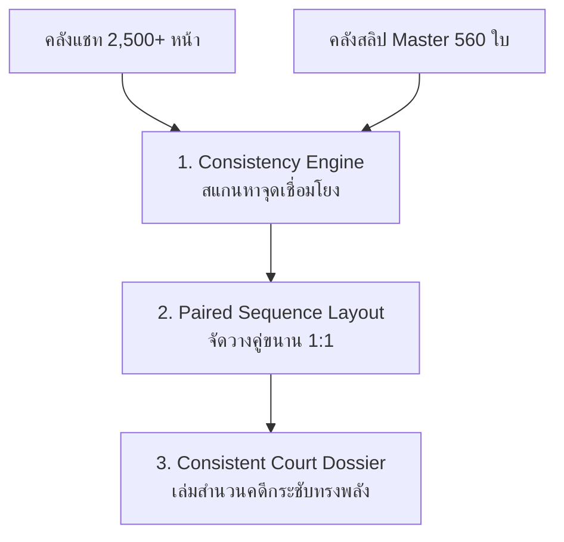

# ⚖️ SKILL SPECIFICATION: consistent-evidence (สกิล Consistent)
## คัมภีร์การสร้างสำนวนคดีฉบับคัดเฉพาะพยานหลักฐานที่สอดคล้องกันแห่งคดี (Court Consistency Protocol)

> **หัวใจสำคัญสูงสุด (The Consistent Smoking Gun Doctrine):**
> ในคดีความทางการเงินและการฉ้อโกง แชทบทสนทนายาว 2,500 กว่าหน้า ส่วนใหญ่คือบทสนทนาทั่วไป (ทักทาย, คุยเล่น, ถามไถ่) ซึ่งศาลและพนักงานสอบสวน **"ไม่มีเวลาเปิดอ่านทีละหน้า"**
>
> สิ่งที่กระบวนการยุติธรรมต้องการเห็นเพื่อชี้ขาดคดีความคือ **"พยานหลักฐานที่มีความสอดคล้องต้องกัน (Consistent / Corroborated Evidence)"**:
> 👉 **[หน้าแชทที่ตกลงกู้ยืม / สั่งให้โอน] ➡️ [ภาพสลิปที่โอนเงินจริงเข้าบัญชี]**
>
> สกิล **`consistent-evidence` (สกิล Consistent)** ทำหน้าที่ตัดขยะบทสนทนาทิ้ง 100% แล้วคัดกรองเฉพาะคู่หลักฐานที่มีความสอดคล้องกันมารวมเป็น **"Consistent Court Edition"** ความยาวกระชับเพียง ~100-200 หน้า ทรงพลัง ชัดเจน และเปิดชี้ในศาลได้ทันที!

---

## 🏛️ 3 เสาหลักแห่งการตรวจสอบความสอดคล้อง (The 3 Pillars of Consistent Skill)



### 1. เสาที่ 1: Consistency Engine (เครื่องยนต์ตรวจจับความสอดคล้อง 3 มิติ)
- **มิติที่ 1: Visual Stamp Match (การตรวจจับภาพสลิปในแชท):** สแกนหาพิกัดและลายนิ้วมือภาพสลิปที่ส่งเข้ามาในบทสนทนา จับคู่กับสลิป Master
- **มิติที่ 2: Semantic Intent Detection (ตรวจจับคำสำคัญแห่งคดี):**
  ตรวจจับข้อความและเจตนาทางคดีความ (สัญญากู้ยืม / ดอกเบี้ย / ทวงหนี้) ด้วยชุดคำสำคัญหลัก (Keywords Ground Truth):
  ```python
  keywords = ["ขอยืม", "ขอกู้", "ขอเงิน", "ปล่อยกู้", "ยืมเงิน", "กู้เงิน", "ดอกเบี้ย", "ทวงหนี้", "โอนคืน", "สัญญา"]
  ```
  รวมถึงคำสั่งโอนหรือการยืนยันยอด (เช่น *"โอนแล้วค่ะ"*, *"ยอด ... บาท"*, *"ขอสลิปหน่อย"*, *"เช็กยอดด้วย"*) ในระยะบับเบิ้ลที่เกี่ยวข้อง
- **มิติที่ 3: Timestamp Proximity Window:** จับคู่เวลาที่พิมพ์ในแชทกับเวลาที่ระบุในสลิป (Time Window ภายใน 15 นาที)

### 2. เสาที่ 2: Paired Sequence Layout (การจัดวางคู่ขนาน 1:1)
- จัดวางหน้าแชทหลักฐาน (ซ้าย) เคียงคู่กับสลิปโอนเงินจริง (ขวา)
- ระบุ Ribbon แสดงสถานะ: `CORROBORATED : สลิปหลักฐานหน้าที่ [X] / สารบัญการเงิน ลำดับที่ [Y]`

### 3. เสาที่ 3: Consistent Court Dossier Output
- ส่งออกเล่มสำนวนเฉพาะคู่หลักฐานที่สอดคล้องกัน พร้อมตารางสรุป 10 คอลัมน์ และใบรับรอง Cryptographic Hash

---

## 🚀 วิธีการใช้งาน (Usage)

```powershell
# ประมวลผลและสร้างเล่มพยานหลักฐานฉบับสอดคล้อง
python _skills/Consistent/scripts/correlate_evidence.py --chats "EVIDENCE_CHAT_IN" --slips "Folder_Out/Evidence_Slips_Master_Unique_560.xlsx"
```
