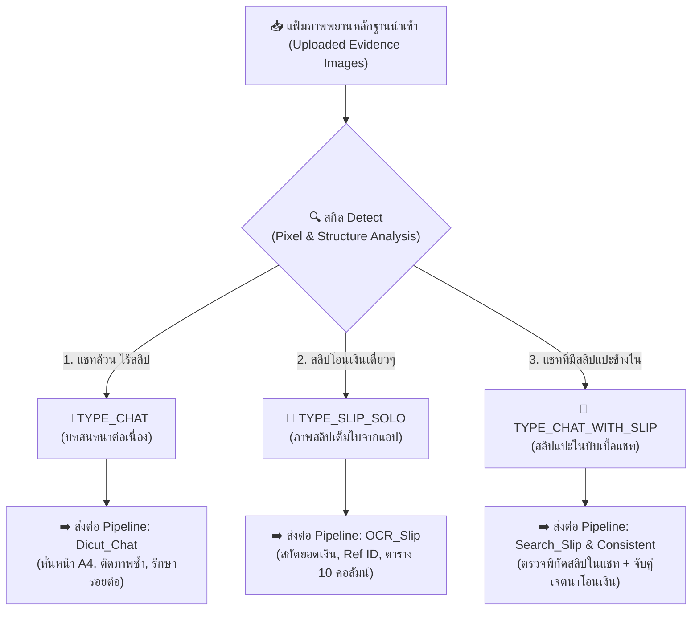

# 🔍 SKILL SPECIFICATION: Detect (สกิล Detect)
## ประตูด่านแรกแห่งการจำแนกประเภทภาพพยานหลักฐานดิจิทัล (Forensic Image Intake & Classification Gateway)

> **หัวใจสำคัญสูงสุด (The Forensic Intake Doctrine):**
> ในคดีความดิจิทัล ผู้เสียหายหรือพนักงานสอบสวนจะรวบรวมไฟล์รูปภาพเข้ามาจำนวนมากอย่างกระจัดกระจาย ทั้งภาพแคปหน้าจอแชท, รูปสลิปเดี่ยวๆ ที่เซฟจากแอปธนาคาร, และภาพหน้าจอแชทที่มีการส่งรูปสลิปแปะอยู่ข้างใน
>
> หากนำภาพทุกรูปแบบไปประมวลผลด้วย Pipeline เดียวกัน ระบบจะล้มเหลว (เช่น นำภาพแชทไปยัดเข้า OCR สลิป หรือนำสลิปเดี่ยวไปหั่นแบบแชท)
>
> สกิล **`Detect`** ถูกสร้างขึ้นเพื่อทำหน้าที่เป็น **"ด่านตรวจคัดกรองพิกเซลแรกสุด (First-Line Intake Gateway)"** ทันทีที่มีการนำเข้าภาพ ระบบจะวิเคราะห์โครงสร้างพิกเซล อัตราส่วน แถบสี และสัญลักษณ์ทางการเงิน แล้วจำแนกประเภทออกเป็น **3 หมวดหมู่หลัก** เพื่อส่งต่อ (Routing) เข้าสู่ Pipeline ปลายทางที่ถูกต้อง 100% โดยอัตโนมัติ

---

## 🏛️ แผนผังการทำงานและการส่งต่อ (Classification & Routing Pipeline)



---

## 📊 รายละเอียด 3 ประเภทหลักฐาน (The 3 Classification Categories)

### 1. `TYPE_CHAT` (ภาพหน้าจอแชทสนทนาล้วน)
* **ลักษณะทางกายภาพ/พิกเซล:**
  - มีลักษณะเป็นบับเบิ้ลข้อความชิดขอบซ้าย (คู่สนทนา) หรือขอบขวา (ผู้ใช้งาน)
  - มีโทนสีพื้นหลังห้องแชท (เช่น สีเบจ `#F5EBE6`, เทาอ่อน หรือดำใน Dark Mode)
  - มีตัวบอกเวลา (Timestamp เช่น `20:53`), ชื่อผู้ส่ง, หรือรูปโปรไฟล์กลม
  - **ไม่พบ** ตราสัญลักษณ์การโอนเงินสำเร็จ หรือรหัส QR Code ธนาคาร
* **ปลายทาง Routing:**
  - ➔ ส่งเข้า **`Dicut_Chat`**: ดำเนินการ Smart Zoom & Crop, หั่นหน้า A4, ตรวจจับรอยต่อ Scroll Overlap

---

### 2. `TYPE_SLIP_SOLO` (ภาพสลิปโอนเงินเดี่ยวเต็มใบ)
* **ลักษณะทางกายภาพ/พิกเซล:**
  - อัตราส่วนภาพแนวตั้งมาตรฐานของสลิปมือถือ (ประมาณ `1:1.6` ถึง `1:2.1`)
  - พื้นหลังภาพเป็นการ์ดสลิปเดี่ยวเต็มหน้าจอ หรือมีขอบเรียบสีขาว/เทาอ่อน
  - มีตราสัญลักษณ์ธนาคาร (KTB, SCB, KBANK, TTB, BBL, BAY, GSB ฯลฯ)
  - ตรวจพบ **QR Code มาตรฐาน EMVCo / PromptPay BScanC** ชัดเจน
  - มีโครงสร้างคำสำคัญการเงิน (เช่น *"โอนเงินสำเร็จ"*, *"จำนวนเงิน"*, *"รหัสอ้างอิง"*)
* **ปลายทาง Routing:**
  - ➔ ส่งเข้า **`OCR_Slip`**: ใช้ Morphological Background Subtraction, ถอดรหัส QR, และสกัดข้อมูลลงสู่ตาราง 10 คอลัมน์มาตรฐาน

---

### 3. `TYPE_CHAT_WITH_SLIP` (ภาพหน้าจอแชทที่มีสลิปแปะอยู่ข้างใน)
* **ลักษณะทางกายภาพ/พิกเซล:**
  - โครงสร้างโดยรวมเป็นหน้าต่างแชท (มีบับเบิ้ล มีเวลา มีข้อความสนทนา)
  - แต่มีพิกัดกรอบย่อย (Sub-Region Card) ข้างในที่มี **Green Transfer Badge (ตราสัญลักษณ์สำเร็จสีเขียว)** หรือรูปภาพสลิปที่ถูกส่งแนบมาในแชท
  - มีทั้งเจตนาการสนทนาและหลักฐานการโอนเงินอยู่ร่วมกันในเฟรมเดียว
* **ปลายทาง Routing:**
  - ➔ ส่งเข้า **`Search_Slip`**: สกัดพิกัด Bounding Box ของสลิป เพื่อปักหมุดเลขหน้า
  - ➔ ส่งเข้า **`Consistent`**: นำสลิปไปจับคู่กับข้อความสั่งโอน/กู้ยืมเงินที่อยู่ก่อนหน้า

---

## 🛠️ ตรรกะการวิเคราะห์พิกเซลของ Engine (Inspection Mechanism)

1. **Badge & Hue Analysis:** ตรวจจับย่านสีของสัญลักษณ์ความสำเร็จทางการเงิน (HSV Green Transfer Range `H: 35-85, S: 120-255, V: 100-255`)
2. **QR Code Finder Patterns:** สแกนหาตำแหน่งของ Finder Pattern สี่เหลี่ยม 3 มุมของ QR Code ธนาคาร
3. **Aspect Ratio & Edge Density:** วิเคราะห์อัตราส่วนภาพ และความหนาแน่นของขอบบับเบิ้ลแชท (Chat Bubble Contours) เทียบกับการ์ดสลิปเดี่ยว
4. **Textual Keyword Cue Matching:** สแกนคีย์เวิร์ดบ่งชี้ประเภทด้วย Tesseract/OCR แบบรวดเร็ว (Fast OCR Pass)

---

## 💻 ตัวอย่างการเรียกใช้งานผ่าน Code / Python API

```python
from _skills.Detect.scripts.detect_classifier import classify_evidence_image, EvidenceType

# จำแนกประเภทภาพเดี่ยว
result = classify_evidence_image("Evidence_Raw/IMG_0192.jpg")

print(f"ผลการวิเคราะห์: {result.type.name}") # TYPE_CHAT, TYPE_SLIP_SOLO, หรือ TYPE_CHAT_WITH_SLIP
print(f"ความเชื่อมั่น: {result.confidence * 100:.1f}%")
print(f"Pipeline ปลายทาง: {result.target_pipeline}")

# นำส่งเข้า Pipeline อัตโนมัติ (Automated Routing)
if result.type == EvidenceType.TYPE_CHAT:
    # เรียก Dicut_Chat
    pass
elif result.type == EvidenceType.TYPE_SLIP_SOLO:
    # เรียก OCR_Slip
    pass
elif result.type == EvidenceType.TYPE_CHAT_WITH_SLIP:
    # เรียก Search_Slip & Consistent
    pass
```
