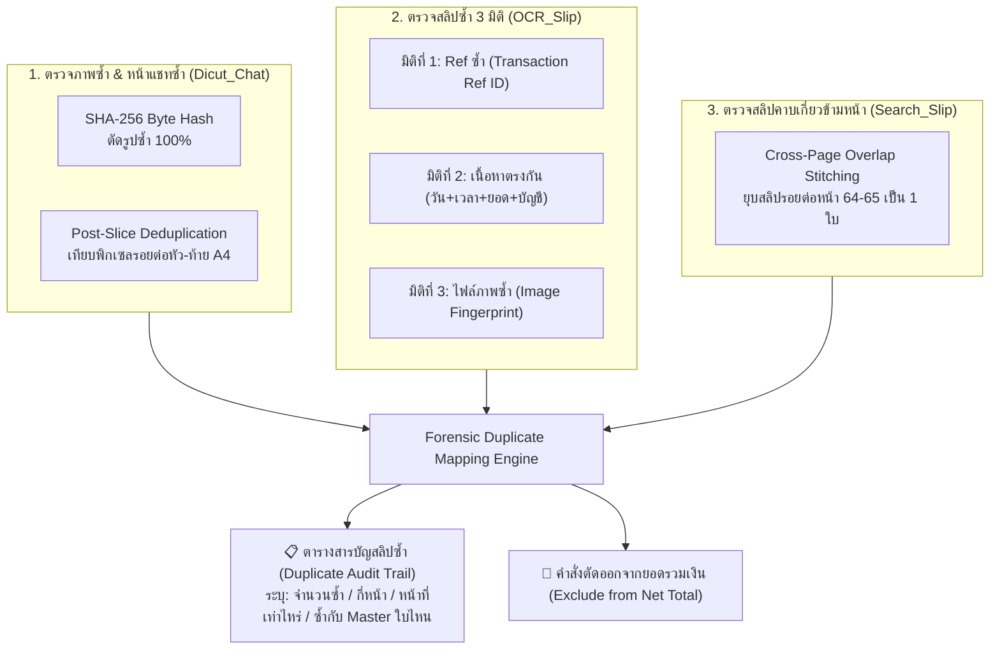

# 📑 SKILL SPECIFICATION: Duplicate (สกิล Duplicate)
## คัมภีร์ตรวจจับและทำสารบัญความซ้ำซ้อนของพยานหลักฐานดิจิทัล (Forensic Deduplication & Cross-Reference Mapping)

> **หัวใจสำคัญสูงสุด (The Deduplication Integrity Doctrine):**
> สกิล **`Duplicate`** ทำหน้าที่เป็นศูนย์กลางประสานและขยายผลตรรกะการตรวจความซ้ำซ้อน **3 หัวข้อหลัก** ที่มีอยู่ในระบบ (`Dicut_Chat`, `OCR_Slip`, `Search_Slip`) **โดยไม่ตัดทอนความสามารถเดิมแม้แต่น้อย** 
> พร้อมเพิ่มทักษะเฉพาะทางในการจัดทำ **"ตารางสารบัญสลิปซ้ำ (Duplicate Cross-Reference Audit Matrix)"** ที่สามารถระบุได้อย่างชัดเจนว่า:
> 1. **มีสลิปซ้ำกันกี่ใบ** (Total Duplicates Count)
> 2. **กินพื้นที่กี่หน้า** (Affected Page Count)
> 3. **ปรากฏอยู่ที่หน้าที่เท่าไหร่บ้าง** (Specific Evidence Page Numbers)
> 4. **เป็นสลิปซ้ำของสลิปต้นฉบับ (Master Slip) ใบไหน** (Master Transaction Pairing)
> เพื่อเป็นหลักฐานชี้แจงศาลและพนักงานสอบสวนได้อย่างโปร่งใส 100%

---

## 🏛️ 3 เสาหลักแห่งการตรวจความซ้ำซ้อน (The 3 Core Deduplication Pillars)

สกิล `Duplicate` รวบรวมและทำงานร่วมกับ 3 กลไกเดิมอย่างเหนียวแน่น:



---

### 1. เสาที่ 1: ตรวจภาพซ้ำ & ตรวจหน้าแชทที่หั่นออกมาซ้ำ (Integrates with `Dicut_Chat`)
* **SHA-256 Hash Matching:** ตรวจค่าแฮชของไฟล์ภาพก่อนประมวลผล หากภาพใดมีไบต์ตรงกัน 100% ระบบคัดทิ้งทันที (`[Dedup: SHA-256]` ข้ามภาพซ้ำ 100%)
* **Post-Slice Deduplication:** หลังจากหั่นแชทเป็นหน้า A4 แล้ว จะเทียบพิกเซลกับหน้าก่อนหน้าทันที หากพบว่าเป็นแชทท่อนซ้ำจากรอยต่อการแคปหน้าจอมือถือ (Scroll Stride Overlap) จะข้ามหน้านั้นทิ้งอัตโนมัติ ไม่นำมาซ้ำในสำนวน

### 2. เสาที่ 2: ตรวจสลิปซ้ำ 3 มิติ (Integrates with `OCR_Slip`)
* **มิติที่ 1 (Ref ซ้ำ):** ตรวจจับรหัสอ้างอิงธุรกรรมธนาคาร (Transaction Ref ID) จาก QR Code หรือ OCR เช่น ถ้าส่งสลิปเดิมซ้ำในแชท จะติดสถานะ:  
  `⚠️ สลิปซ้ำ (Ref ซ้ำกับ Master ลำดับที่ X)`
* **มิติที่ 2 (เนื้อหาตรงกัน):** ตรวจจับคู่ 5 มิติ `(วันที่ + เวลา + ยอดเงิน + บัญชีผู้โอน + บัญชีผู้รับ)` แม้ชื่อไฟล์จะเปลี่ยน หรือสลิปถูกแคปมาคนละมุม ถ้าข้อมูลตรงกันจะติดสถานะ:  
  `⚠️ ข้อมูลซ้ำ (Duplicate Data Payload)`
* **มิติที่ 3 (ไฟล์ภาพซ้ำ):** ตรวจจับรูปซ้ำด้วย Image Perceptual Hash (pHash)  
  `⚠️ ไฟล์ซ้ำ (ภาพเดียวกับ Master ลำดับที่ X)`

### 3. เสาที่ 3: ตรวจสลิปคาบเกี่ยวข้ามหน้า (Integrates with `Search_Slip`)
* **Cross-Page Overlap Boundary:** ป้องกันการนับยอดเงินเบิ้ล กรณีรูปสลิปติดอยู่ตรงรอยต่อระหว่างหน้า เช่น ท่อนบนติดที่ท้ายหน้า 64 และท่อนล่างติดที่หัวหน้า 65 ระบบจะรวมเป็นรายการเดียวด้วย Ref ID และปักหมุดพิกัดหน้าคู่ `หน้า 64 - 65`

---

## 📊 ทักษะการแจกแจงพิกัดความซ้ำซ้อน (Duplicate Traceability Matrix)

เมื่อสกิล `Duplicate` ตรวจพบสลิปซ้ำ จะไม่ลบหลักฐานทิ้งอย่างไร้ร่องรอย แต่จะสร้าง **ตารางสารบัญสลิปซ้ำ (Duplicate Cross-Reference Audit Sheet)** แจกแจง 5 มิติสำคัญ:

| ลำดับจุดที่พบ | ตำแหน่งหน้าที่พบ | รหัสธุรกรรม (Ref ID) | สลิปต้นฉบับที่ตรงกัน | ยอดเงินสลิป | สาเหตุความซ้ำซ้อน | สถานะทางคดี |
|:---:|:---|:---|:---|:---:|:---|:---:|
| จุดที่ 3 | แชทหน้า 3 | `KBANK0948X01` | **Master Slip #01** | ฿ 50,000.00 | ส่งภาพเดิมซ้ำในแชทเพื่อยืนยันยอด | 🚫 ไม่นับซ้ำ |
| จุดที่ 6 | แชทหน้า 14 - 15 | `SCB1120M02` | **Master Slip #02** | ฿ 120,000.00 | รอยต่อการเลื่อนแคปหน้าจอข้ามหน้า | 🚫 ไม่นับซ้ำ |
| จุดที่ 8 | แชทหน้า 22 | `KTB1405T03` | **Master Slip #03** | ฿ 75,000.00 | รูปเดียวกันแต่ครอปคนละสัดส่วน | 🚫 ไม่นับซ้ำ |
| จุดที่ 11 | แชทหน้า 28 | `TTB0915K04` | **Master Slip #04** | ฿ 60,000.00 | ส่งต่อสลิปเดิมซ้ำในห้องแชท | 🚫 ไม่นับซ้ำ |

### รายงานสรุปพิกัดความซ้ำซ้อน (Audit Summary):
* **จำนวนสลิปที่ซ้ำกันทั้งหมด:** 12 ใบ
* **จำนวนหน้าที่ได้รับผลกระทบ:** 8 หน้า
* **หน้าที่ปรากฏรายการซ้ำ:** หน้า 3, 14-15, 22, 28, 45, 64-65, 82
* **จับคู่ตรงกับสลิปต้นฉบับ:** ตรงกับ Master Slips ลำดับที่ #01, #02, #03, #04, #07, #09

---

## 💻 ตัวอย่างการเรียกใช้งานผ่าน Code / Python API

```python
from _skills.Duplicate.scripts.duplicate_audit import audit_duplicate_evidence

# รันการตรวจสอบความซ้ำซ้อนทั้งสำนวน
audit_result = audit_duplicate_evidence(
    scanned_occurrences="Folder_Out/all_detected_slips.json",
    master_slips="Folder_Out/master_slips.json"
)

print(f"ตรวจพบสลิปซ้ำ: {audit_result.duplicate_count} ใบ")
print(f"หน้าที่พบสลิปซ้ำ: {audit_result.affected_pages}")
# แสดงตาราง Cross-Reference ไปยัง Master Slips
for item in audit_result.cross_reference_table:
    print(f"หลักฐานจุดที่ {item.occurrence_id} หน้า {item.page_num} -> ซ้ำกับ {item.master_slip_id}")
```
