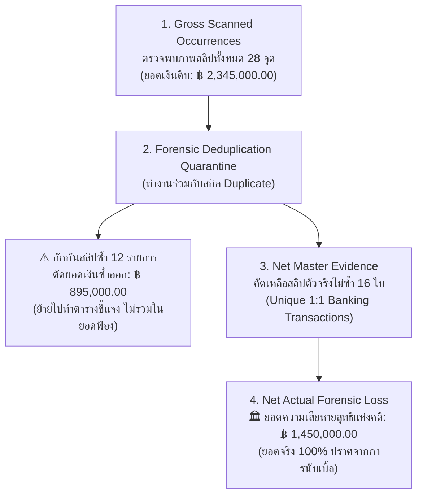

# 💰 SKILL SPECIFICATION: NET_Detail (สกิล NET_Detail)
## คัมภีร์การคำนวณยอดความเสียหายสุทธิและป้องกันการนับยอดเงินซ้ำซ้อนแห่งคดี (Forensic Net Evidence & Anti-Double-Counting Protocol)

> **หัวใจสำคัญสูงสุด (The Net Financial Truth Doctrine):**
> ในคดีความทางเศรษฐกิจ การฉ้อโกง หรือการฟ้องร้องเรียกเงินคืน **"ยอดเงินความเสียหายคือหัวใจชี้เป็นชี้ตายของคดี"**
> หากระบบพยานหลักฐานนำภาพสลิปทุกจุดที่ตรวจพบในแฟ้มสำนวนมาบวกตัวเลขรวมกันแบบตรงไปตรงมา จะเกิด **"ภาวะยอดเงินลวงตาจากการนับซ้ำ (Gross Double-Counted Inflation)"**
> 
> ซึ่งหากสำนวนที่ยอดเงินซ้ำซ้อนหลุดไปถึงศาล:
> 1. ทนายจำเลยจะชี้ข้อบกพร่องว่าโจทก์เจตนานำสลิปเดิมมาวนคิดเงินซ้ำ
> 2. ศาลอาจยกประโยชน์แห่งความสงสัย และปฏิเสธการคิดยอดความเสียหายทั้งหมด!
>
> สกิล **`NET_Detail`** ถูกสร้างขึ้นเพื่อ **"ป้องกันการบวกยอดเงินซ้ำซ้อน 100%"** โดยทำหน้าที่สอบทานจำนวนจุด/ไฟล์ที่ตรวจพบ แยกยอดสลิปซ้ำออกจากสมการ และสรุป **"ยอดความเสียหายสุทธิตามกฎหมาย (Net Actual Forensic Loss)"** พร้อมตารางกระทบยอดเงินที่ศาลและพนักงานสอบสวนตรวจรับได้อย่างไร้ข้อกังขา!

---

## 🏛️ ตรรกะการคำนวณงบสุทธิ 4 ขั้นตอน (The 4-Step Net Reconciliation Pipeline)



---

## 📊 ตัวแปรและเมตริกหลักของสกิล NET_Detail (The 4 Core Financial Metrics)

| ลำดับตัวแปร | ชื่อตัวแปรทางนิติวิทยาศาสตร์ | ตัวอย่างค่า | ความหมายในสำนวนคดี |
|:---:|:---|:---:|:---|
| 1 | **Gross Detected Points (`gross_detected`)** | **28 จุด** | จำนวนจุด/ไฟล์ที่ระบบตรวจพบรูปสลิปทั้งหมด (สลิปเดี่ยว 10 ใบ + แชท 18 จุด) |
| 2 | **Gross Inflated Amount (`gross_amount`)** | **฿ 2,345,000.00** | ยอดเงินรวมหากนำทุกจุดมาบวกกัน (ห้ามใช้ยอดนี้ส่งศาลเด็ดขาด!) |
| 3 | **Excluded Duplicates (`excluded_duplicates`)** | **12 ใบ / ฿ 895,000.00** | สลิปที่ส่งซ้ำ/แคปเหลื่อมข้ามหน้า ตัดออกจากยอดเงินฟ้อง แต่แนบตารางอธิบาย |
| 4 | **Net Master Slips (`net_master_count`)** | **16 รายการ** | จำนวนธุรกรรมการเงินจริงที่ไม่ซ้ำกัน (Core Banking Master Records) |
| 5 | **Net Actual Loss (`net_actual_amount`)** | **฿ 1,450,000.00** | **ยอดเงินความเสียหายแท้จริงที่ถูกต้องตามกฎหมาย 100%** |

---

## 🧾 ผลลัพธ์มาตรฐานที่สกิล NET_Detail สร้างขึ้น (Standard Court Outputs)

### 1. แถบสรุปสถานะการเงินสุทธิบนระบบและเล่มสำนวน (Net Stat Banner)
```text
========================================================================================
🏛️ DIGITAL EVIDENCE — สรุปงบพยานหลักฐานการเงินสุทธิ (FORENSIC NET LOSS STATEMENT)
----------------------------------------------------------------------------------------
- จำนวนจุดตรวจพบทั้งหมด (Gross Occurrences):    28 จุด (ไฟล์เดี่ยว 10 + ในแชท 18)
- ตรวจพบสลิปซ้ำซ้อน (Redundant Duplicates):     12 ใบ (ครอบคลุมแชท 8 หน้า)
- ยอดเงินซ้ำซ้อนที่สกัดทิ้ง (Excluded Redundancy): ฿ 895,000.00  [ป้องกันการนับเบิ้ล]
- สลิปต้นฉบับแท้จริง (Net Master Slips):         16 รายการ
----------------------------------------------------------------------------------------
>>> ยอดความเสียหายแท้จริงแห่งคดี (NET ACTUAL LOSS): ฿ 1,450,000.00 <<<
========================================================================================
```

### 2. ตารางกระทบยอดเงินส่งศาล (Court Financial Reconciliation Table)
แสดงการพิสูจน์ที่มาของตัวเลขยอดเงินอย่างโปร่งใส:
* **ยอดตรวจพบรวม (Gross Sum):** 28 จุด = 2,345,000.00 บาท
* **หัก:** รายการสลิปส่งซ้ำในแชท (7 จุด) = -450,000.00 บาท
* **หัก:** รายการสลิปรอยต่อการแคปหน้าจอข้ามหน้า (3 จุด) = -245,000.00 บาท
* **หัก:** รายการสลิปครอปภาพขนาดต่างกัน (2 จุด) = -200,000.00 บาท
* **ยอดความเสียหายสุทธิที่เรียกร้องได้จริง (Net Forensic Claim):** **1,450,000.00 บาท**

---

## 💻 ตัวอย่างการเรียกใช้งานผ่าน Code / Python API

```python
from _skills.NET_Detail.scripts.net_detail_calc import calculate_net_financial_evidence

# ส่งข้อมูลรายการตรวจพบทั้งหมดเข้าระบบคำนวณยอดสุทธิ
net_summary = calculate_net_financial_evidence(
    all_occurrences="Folder_Out/all_detected_slips.json"
)

print(f"จุดตรวจพบทั้งหมด: {net_summary.gross_detected} จุด")
print(f"สลิปซ้ำที่ตัดออก: {net_summary.duplicate_count} ใบ (ยอดซ้ำ ฿ {net_summary.excluded_amount:,.2f})")
print(f"สลิปต้นฉบับสุทธิ: {net_summary.net_master_count} ใบ")
print(f"ยอดความเสียหายสุทธิจริง: ฿ {net_summary.net_actual_amount:,.2f}")

# สร้างรายงานสรุปงบสุทธิส่งศาล (Forensic Reconciliation Statement)
net_summary.export_reconciliation_pdf("Folder_Out/Court_Net_Loss_Statement.pdf")
```
