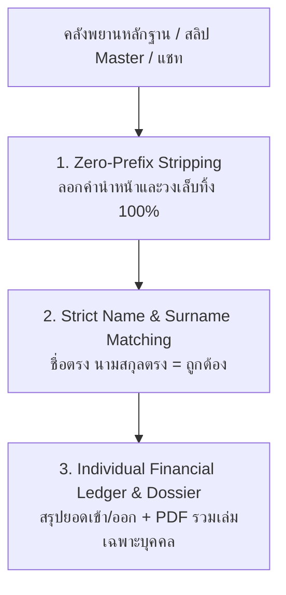

# 🏛️ SKILL SPECIFICATION: target-name-matcher (สกิล Name)
## คัมภีร์การคัดกรองพยานหลักฐานเฉพาะบุคคลเป้าหมาย (Individual Forensic Target Doctrine)

> **หัวใจสำคัญสูงสุด (The Absolute Identity Doctrine):**
> ในคดีความทางการเงิน สลิปโอนเงิน หรือบันทึกแชท มักมีการเขียนชื่อบุคคลเดียวกันในหลากหลายรูปแบบเนื่องจากระบบธนาคารที่แตกต่างกัน เช่น:
> - `น.ส. จิณห์นิภา ประสาทเขตการ`
> - `นางสาวจิณห์นิภา ประสาทเขตการ`
> - `คุณจิณห์นิภา ประสาทเขตการ`
> - `จิณห์นิภา ประสาทเขตการ (XXX-X-XX452-9)`
> - `Ms. Jinnipa Prasatkhetkan`
>
> หากระบบตั้งเงื่อนไขแบบ String Matching ทั่วไป รายการเหล่านี้จะไม่ตรงกัน และทำให้พยานหลักฐานทางการเงินของบุคคลเป้าหมาย **"ตกหล่น"**
>
> สกิล **`target-name-matcher` (สกิล Name)** สถาปนาขึ้นภายใต้ธรรมนูญ:
> 👉 **"ไม่สนว่าจะมีคำนำหน้าว่าอะไร ชื่อตรง นามสกุลตรง นั้นคือถูก"**
> ระบบจะทำการลอกคำนำหน้าชื่อ ยศ ตำแหน่ง ฐานันดรศักดิ์ และเลขบัญชีทิ้ง 100% เพื่อพิสูจน์อัตลักษณ์บุคคลเป้าหมายอย่างแม่นยำระดับนิติวิทยาศาสตร์!

---

## 🏛️ 3 เสาหลักของการคัดกรองบุคคลเป้าหมาย (The 3 Pillars of Name Skill)



### 1. เสาที่ 1: Zero-Prefix Stripping Engine (พจนานุกรมคำนำหน้าชื่อสมบูรณ์แบบ)
เครื่องยนต์จะทำการคัดกรองและลบคำนำหน้าชื่อทุกประเภทออกก่อนการเปรียบเทียบเสมอ:
- **ยศตำรวจ / ทหาร:** พล.ต.อ., พ.ต.อ., พ.ต.ท., พ.ต.ต., ร.ต.อ., ด.ต., จ.ส.ต., ส.ต.อ., พล.อ., พ.อ., พ.ท., ร.อ., จ.ส.อ., ว่าที่ ร.ต. ฯลฯ
- **วิชาการ / การแพทย์:** ศ., รศ., ผศ., ดร., นพ., พญ., ทพ., ภก., อ.
- **ฐานันดรศักดิ์ / ขุนนาง:** ม.ร.ว., ม.ล., ม.จ.
- **สามัญชนทั่วไป:** นาย, นาง, นางสาว, น.ส., ด.ช., ด.ญ., คุณ, ท่าน
- **นิติบุคคล / ห้างร้าน:** บจก., บมจ., หจก., บริษัท, ร้าน
- **ภาษาอังกฤษ:** Mr., Mrs., Miss, Ms., Dr., Prof., Pol., Gen., Col., Capt. ฯลฯ
- **บัญชีธนาคาร / วงเล็บ:** กำจัดข้อความในวงเล็บ `(XXX-X-XX452-9)` และคำกำกับ `ผู้โอน:` หรือ `ผู้รับโอน:` ออกอัตโนมัติ

### 2. เสาที่ 2: Strict Name & Surname Matching ("ชื่อตรง นามสกุลตรง นั้นคือถูก")
- **First Name Check:** ตรวจสอบชื่อต้น (First Name) ต้องตรงกัน 100%
- **Last Name Check:** ตรวจสอบนามสกุล (Last Name) ต้องตรงกัน 100%
- **Masked Surname Tolerance (สำหรับสลิปธนาคาร):** รองรับกรณีระบบธนาคารปิดบังนามสกุล เช่น `ณัฐชัย ร***` เมื่อค้นหา `ณัฐชัย` หรือชื่อ-นามสกุลที่ขึ้นต้นด้วยตัวอักษรเดียวกัน จะสามารถตรวจจับได้อย่างชาญฉลาดโดยไม่หลุดรอด

### 3. เสาที่ 3: Individual Financial Ledger & Dossier Delivery
เมื่อพบรายการที่ตรงกับบุคคลเป้าหมาย ระบบจะผลิตรายงาน 2 ชนิดทันที:
1. **Excel Forensic Ledger (ตาราง 11 คอลัมน์):**
   - รูปแบบมาตรฐาน Sarabun Center-Aligned Grid 100%
   - คอลัมน์ระบุบทบาทชัดเจน: `ผู้รับโอน (Inflow)` หรือ `ผู้โอน (Outflow)`
   - สรุปยอดเงินรวม 2 มิติ: **รวมยอดรับโอน (Inflow)** และ **รวมยอดโอนออก (Outflow)**
   - คำสั่งกำกับ Disclaimer ท้ายตารางเพื่อความสมบูรณ์ในชั้นศาล
2. **Dedicated PDF Evidence Dossier:**
   - รวบรวมเฉพาะภาพสลิปที่เกี่ยวข้องกับบุคคลนั้น
   - จัดหน้าตามมาตรฐาน **Stage Forensic Smart Zoom & Crop** (ขยาย 900px บนพื้น Pure White `#FFFFFF`)
   - หัวกระดาษกำกับ: `MODE : TARGET EVIDENCE | บุคคลเป้าหมาย: [ชื่อ] | บทบาท: [SENDER/RECEIVER]`

---

## 💻 วิธีการเรียกใช้งานคำสั่ง (Execution Commands)

### 1. ค้นหาผ่านชื่อเต็ม (First & Last Name):
```powershell
python tools/name_filter.py --name "จิณห์นิภา ประสาทเขตการ"
```

### 2. แยกชื่อต้นและนามสกุล หรือกรองเฉพาะบทบาท:
```powershell
# กรองเฉพาะเมื่อเป็นผู้รับโอน (Receiver Only)
python tools/name_filter.py --first "จิณห์นิภา" --last "ประสาทเขตการ" --role receiver

# กรองเฉพาะเมื่อเป็นผู้โอน (Sender Only)
python tools/name_filter.py --name "ณัฐชัย" --role sender
```

### 3. โหมดถามตอบผ่านเมนูโต้ตอบ (Interactive Prompt):
```powershell
python tools/name_filter.py
# ระบบจะถาม: "กรุณาระบุชื่อ-นามสกุลเป้าหมายที่ต้องการค้นหา:"
```

---

## 📁 OUTPUT ARTIFACTS ที่ผลิตได้
- `Folder_Out/Evidence_Target_[First]_[Last].xlsx` (ตารางบัญชีพยานหลักฐาน 11 คอลัมน์)
- `Folder_Out/Evidence_Target_[First]_[Last].pdf` (เล่มสำนวนรวมสลิปของบุคคลเป้าหมาย)
