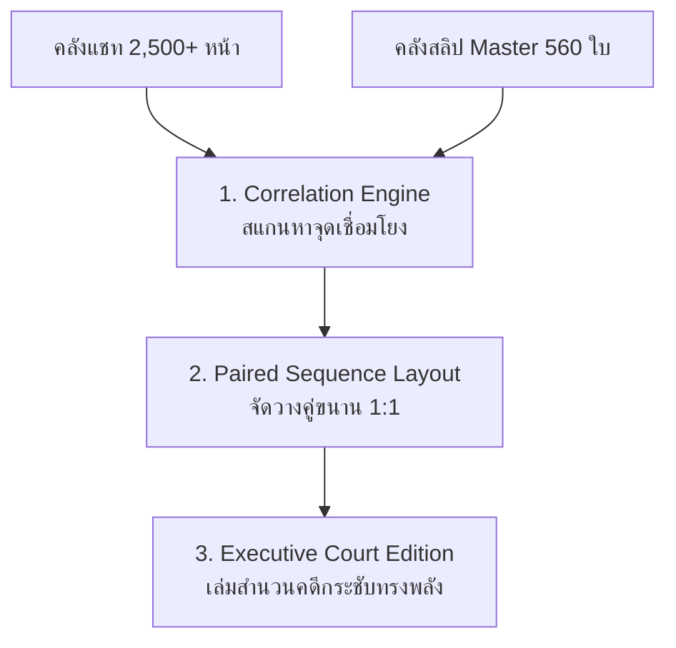

# 🏛️ SKILL SPECIFICATION: only-corroborated (สกิล Only)
## คัมภีร์การสร้างสำนวนคดีฉบับคัดเฉพาะพยานหลักฐานสำคัญแห่งคดี (Executive Court Corroboration Protocol)

> **หัวใจสำคัญสูงสุด (The Smoking Gun Doctrine):**
> ในคดีความทางการเงินและการฉ้อโกง แชทบทสนทนายาว 2,500 กว่าหน้า ส่วนใหญ่คือบทสนทนาทั่วไป (ทักทาย, คุยเล่น, ถามไถ่) ซึ่งศาลและพนักงานสอบสวน **"ไม่มีเวลาเปิดอ่านทีละหน้า"**
>
> สิ่งที่กระบวนการยุติธรรมต้องการเห็นเพื่อชี้ขาดคดีความคือ **"พยานหลักฐานเชื่อมโยง (Corroborated Evidence)"**:
> 👉 **[หน้าแชทที่ตกลงกู้ยืม / หลอกให้โอน] ➡️ [ภาพสลิปที่โอนเงินจริงเข้าบัญชี]**
>
> สกิล **`only-corroborated` (สกิล Only)** ทำหน้าที่ตัดขยะบทสนทนาทิ้ง 100% แล้วคัดกรองเฉพาะคู่หลักฐานสำคัญมารวมเป็น **"Executive Court Edition"** ความยาวกระชับเพียง ~100-200 หน้า ทรงพลัง ชัดเจน และเปิดชี้ในศาลได้ทันที!

---

## 🏛️ 3 เสาหลักแห่งการคัดกรองหลักฐานเชื่อมโยง (The 3 Pillars of Only Skill)

### 1. เสาที่ 1: Correlation Engine (เครื่องยนต์ตรวจจับความเชื่อมโยง 3 มิติ)
- **มิติที่ 1: Visual Stamp Match (การตรวจจับภาพสลิปในแชท):** สแกนหาพิกัดและลายนิ้วมือภาพสลิปที่ส่งเข้ามาในบทสนทนา จับคู่กับสลิป Master
- **มิติที่ 2: Semantic Intent Detection (คำสำคัญสั่งโอน):** ตรวจจับประโยคสั่งโอน เช่น *"โอนแล้วค่ะ"*, *"ยอด 15,000 บาท"*, *"ขอสลิปหน่อย"*, *"เช็กยอดด้วย"* ในระยะ ±3 บับเบิ้ลของรูปสลิป
- **มิติที่ 3: Timestamp Proximity Window:** จับคู่เวลาที่พิมพ์ในแชทกับเวลาที่ระบุในสลิป (Time Window ภายใน 15 นาที)

### 2. เสาที่ 2: Paired Sequence Layout (การจัดวางคู่ขนาน 1:1)
ทุกรายการที่ผ่านเกณฑ์ จะถูกจัดวางเคียงคู่กันอย่างเป็นระบบ:
- **หน้า A (Chat Page):** หน้าแชทจริงที่มีบทสนทนาตกลงโอนเงิน (ตัดต่อแบบ Dicut_Chat ไร้ขอบดำ)
- **หน้า B (Slip Page):** สลิปการเงินจริงที่โอนตามบทสนทนานั้น (Stage Forensic Smart Zoom & Crop ขยาย 900px บนพื้น Pure White `#FFFFFF`)
- **Header Ribbon:** กำกับชัดเจน เช่น:
  `MODE : CORROBORATED | ภาพแชทหน้าที่ 45 เชื่อมโยง สลิปหลักฐานลำดับที่ 12`

### 3. เสาที่ 3: Court-Ready Executive Dossier
- **สารบัญคู่ขนาน (Corroborated Index):** ตาราง 10 คอลัมน์ที่ระบุ `[หน้าแชท] ⟷ [หน้าสลิป]` ยอดเงิน และบัญชีปลายทาง
- **Cryptographic Hash Certificate:** ประทับตรารับรอง SHA-256 Checksum ตาม พ.ร.บ. ธุรกรรมทางอิเล็กทรอนิกส์ พ.ศ. 2544

---

## 📋 WORKFLOW การทำงานของสกิล `Only`

1. **Phase 1: Input Ingestion:** รับโฟลเดอร์แชท และโฟลเดอร์สลิป Master (560 ใบ)
2. **Phase 2: Automated Correlation Audit:** จับคู่หน้าแชทกับสลิป สกัดเป็น `correlation_manifest.json`
3. **Phase 3: Dual-Page Assembler:** สลับสร้างหน้า [แชทคู่กรณี] ➡️ [สลิปยืนยัน]
4. **Phase 4: Synthesis & Output:** รวมเล่มเป็น `Evidence_Court_Executive_Edition_Only.pdf` พร้อมตารางสรุป
