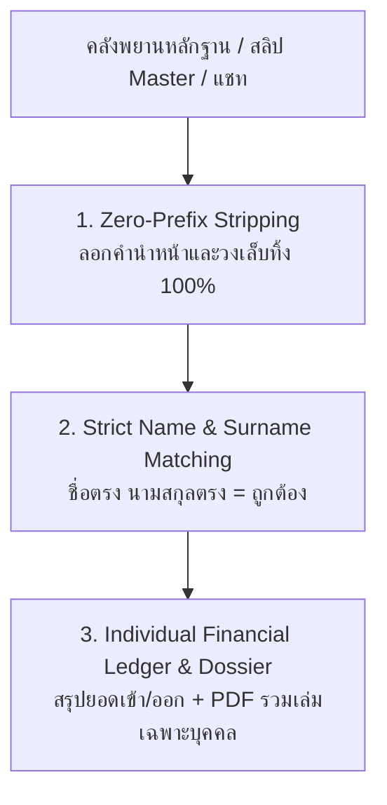

# 🎯 SKILL SPECIFICATION: only-target-filter (สกิล Only)
## คัมภีร์การคัดกรองพยานหลักฐานเฉพาะบุคคลเป้าหมาย (Individual Forensic Target Doctrine)

> **หัวใจสำคัญสูงสุด (The Absolute Identity Doctrine):**
> ในคดีความทางการเงิน สลิปโอนเงิน หรือบันทึกแชท มักมีการเขียนชื่อบุคคลเดียวกันในหลากหลายรูปแบบเนื่องจากระบบธนาคารที่แตกต่างกัน เช่น:
> - `น.ส. จิณห์นิภา ประสาทเขตการ`
> - `นางสาวจิณห์นิภา ประสาทเขตการ`
> - `คุณจิณห์นิภา ประสาทเขตการ`
> - `จิณห์นิภา ประสาทเขตการ (XXX-X-XX452-9)`
> - `Ms. Jinnipa Prasatkhetkan`
>
> หากระบบตั้งเงื่อนไขแบบ String Matching ทั่วไป รายการเหล่านี้จะไม่ตรงกัน และทำให้พยานหลักฐานทางการเงินของบุคคลเป้าหมาย **"ตกหล่น"**
>
> สกิล **`only-target-filter` (สกิล Only)** สถาปนาขึ้นภายใต้ธรรมนูญ:
> 👉 **"ไม่สนว่าจะมีคำนำหน้าว่าอะไร ชื่อตรง นามสกุลตรง นั้นคือถูก"**
> ระบบจะทำการลอกคำนำหน้าชื่อ ยศ ตำแหน่ง ฐานันดรศักดิ์ และเลขบัญชีทิ้ง 100% เพื่อพิสูจน์อัตลักษณ์บุคคลเป้าหมายอย่างแม่นยำระดับนิติวิทยาศาสตร์!

---

## 🏛️ 3 เสาหลักของการคัดกรองบุคคลเป้าหมาย (The 3 Pillars of Only Skill)


```mermaid
graph TD
    A[คลังพยานหลักฐาน / สลิป Master / แชท] --> B[1. Zero-Prefix Stripping<br>ลอกคำนำหน้าและวงเล็บทิ้ง 100%]
    B --> C[2. Strict Name & Surname Matching<br>ชื่อตรง นามสกุลตรง = ถูกต้อง]
    C --> D[3. Individual Financial Ledger & Dossier<br>สรุปยอดเข้า/ออก + PDF รวมเล่มเฉพาะบุคคล]
```

### 1. เสาที่ 1: Zero-Prefix Stripping Engine (พจนานุกรมคำนำหน้าชื่อสมบูรณ์แบบ)
เครื่องยนต์จะทำการคัดกรองและลบคำนำหน้าชื่อทุกประเภทออกก่อนการเปรียบเทียบเสมอ:
- **ยศตำรวจ / ทหาร:** พล.ต.อ., พ.ต.อ., พ.ต.ท., พ.ต.ต., ร.ต.อ., ด.ต., จ.ส.ต., ส.ต.อ., พล.อ., พ.อ., พ.ท., ร.อ., จ.ส.อ., ว่าที่ ร.ต. ฯลฯ
- **วิชาการ / การแพทย์:** ศ., รศ., ผศ., ดร., นพ., พญ., ทพ., ภก., อ.
- **ฐานันดรศักดิ์ / ขุนนาง:** ม.ร.ว., ม.ล., ม.จ.
- **สามัญชนทั่วไป:** นาย, นาง, นางสาว, น.ส., ด.ช., ด.ญ., คุณ, ท่าน
- **นิติบุคคล / ห้างร้าน:** บจก., บมจ., หจก., บริษัท, ร้าน

### 2. เสาที่ 2: Strict Name & Surname Matching (การจับคู่ชื่อ-นามสกุล 100%)
- สกัดชื่อจริง (First Name) และนามสกุล (Last Name) จากข้อความ
- เปรียบเทียบกับชื่อบุคคลเป้าหมายที่พนักงานสอบสวนระบุ
- หากทั้งชื่อและนามสกุลตรงกัน 100% ให้ถือว่าเป็นบุคคลเป้าหมายทันที

### 3. เสาที่ 3: Automated Entity Discovery & Chat vs Slip Breakdown (ตรวจจับชื่ออัตโนมัติและแยกสัดส่วนหลักฐาน)
- ระบบทำการสแกนหาชื่อ-นามสกุล และนิติบุคคลทั้งหมดที่ปรากฏอยู่ในสลิป (ชื่อผู้โอน/ผู้รับโอน) และในแชท (ชื่อผู้ส่ง/ชื่อที่ถูกกล่าวถึงในบทสนทนา) อัตโนมัติ โดยผู้ใช้ไม่ต้องพิมพ์กรอกทีละชื่อ
- ทำการสรุปความถี่และแจกแจงพิกัดหลักฐานแยกเป็น 2 มิติชัดเจน:
  1. **ความถี่ในแชท (Chat Evidence Occurrences):** ระบุจำนวนครั้งและหน้าที่พบในบทสนทนา (เช่น `💬 แชท 7`)
  2. **ความถี่ในสลิป (Slip Evidence Occurrences):** ระบุจำนวนใบและหน้าที่พบในสลิปโอนเงิน (เช่น `📄 สลิป 5`)
  3. **รวมหลักฐานทั้งหมด (Total Corroborated Evidence):** ผลรวมหลักฐานของบุคคลนั้น (เช่น `12 หลักฐาน`)

### 4. เสาที่ 4: Individual Financial Ledger & Dossier Output
ส่งออกสำนวนคดีเฉพาะบุคคล 2 รูปแบบ:
1. **Excel Ledger:** สรุปยอดเงินโอนเข้า, โอนออก, ยอดคงเหลือ และรายการสลิปทั้งหมด
2. **PDF Master Dossier:** รวมภาพสลิปที่เกี่ยวข้องกับบุคคลเป้าหมายแบบ 1:1 เรียงตามลำดับเวลา (Timeline)

---

## 🚀 วิธีการใช้งาน (Usage)

```powershell
# คัดกรองพยานหลักฐานเฉพาะบุคคลเป้าหมาย
python _skills/Only/scripts/filter_target.py --name "จิณห์นิภา ประสาทเขตการ" --input "Folder_Out/Evidence_Slips_Master_Unique_560.xlsx"
```
