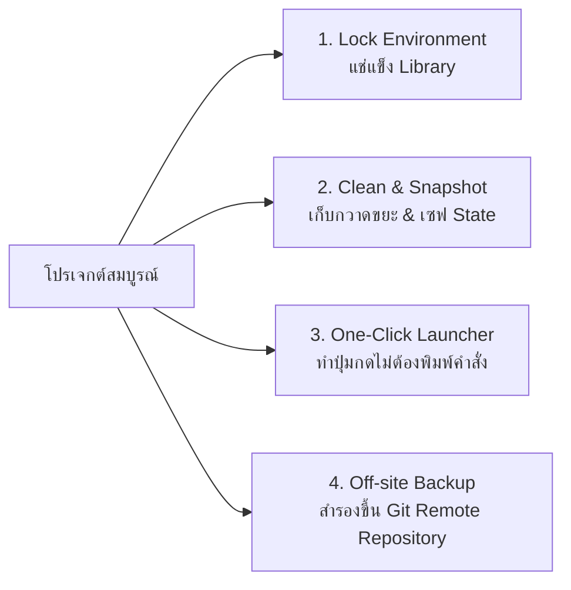

### name: save-project-state
description: Skill สกัด รวบรวม และบันทึกสถานะของโปรเจกต์ ประวัติการแชทแบบบับเบิ้ล ตรรกะระบบ การแช่แข็งสภาพแวดล้อม และเชื่อมต่อ Git Remote Repository เข้าสู่คลังถาวร เพื่อให้โปรเจกต์เป็นอมตะ (Immortal Project) ทำงานได้สมบูรณ์แบบตลอดกาล

---

# 🏛️ SKILL SPECIFICATION: save-project-state (SAVE.md)
## คัมภีร์วิศวกรรมความคงทนและการทำซ้ำได้ของโปรเจกต์ (Software Preservation & Reproducibility Doctrine)

> **หัวใจสำคัญสูงสุด:** หลายคนที่ทำโปรเจกต์เสร็จ พอผ่านไป 6 เดือน หรือย้ายเครื่อง/ลง Windows ใหม่ กลับมาเปิดอีกทีแล้ว **"พัง"** เพราะ:
> 1. **ลืมว่าต้องพิมพ์คำสั่งอะไร** (Lack of Zero-Command Launcher)
> 2. **Library หรือ Python อัปเดตเวอร์ชันใหม่** จนโค้ดเดิมรันไม่ผ่าน (Dependency Drift)
> 3. **ขาดไฟล์การตั้งค่า หรือข้อมูลสูญหายไปกับเครื่องเก่า** (Lack of Git Remote / Off-site Backup)
>
> สกิลนี้ถูกสร้างขึ้นเพื่อปิดช่องโหว่ทั้ง 3 ข้อ ทำให้โปรเจกต์อยู่ในสถานะ **"สมบูรณ์ นิ่ง และเป็นอมตะ (Immortal Project)"** เรียกใช้งานเมื่อไหร่ก็ทำงานได้สมบูรณ์แบบ 100% เสมอ

---

## 🏛️ 4 เสาหลักของการรักษาโปรเจกต์ให้สมบูรณ์ตลอดกาล (The 4 Pillars)



1. **เสาที่ 1: Lock Environment (แช่แข็งไลบรารี):** บันทึกเวอร์ชันของทุก Library ที่ใช้งานจริงลง `requirements.txt` วันข้างหน้าลงเครื่องใหม่เพียงสั่ง `pip install -r requirements.txt` จะได้สภาพแวดล้อมเดิม 100%
2. **เสาที่ 2: Clean & Snapshot (ทำความสะอาดและบันทึกประวัติ):** เคลียร์ไฟล์ชั่วคราว/แคช (`__pycache__`, `.tmp`, logs) แล้วสกัดสถานะโปรเจกต์ออกมาเป็น 4 มิติหลัก (README, STATUS, CHAT, FLOW) พร้อมสำรองลง `state/`
3. **เสาที่ 3: One-Click Launcher (ตัวสั่งงานคลิกเดียว):** สร้างสคริปต์คำสั่งสำเร็จรูป (`.bat` / `.ps1` / Windows Startup) เพื่อให้ผู้ใช้สามารถ "ดับเบิลคลิก" หรือ "ลากไฟล์มาหย่อนทับ (Drag & Drop)" ใช้งานได้ทันทีโดยไม่ต้องจำคำสั่งคอนโซล
4. **เสาที่ 4: Off-site Backup (สำรองขึ้น Git Remote Repository):** ต้องผูกและ Push โค้ดทั้งหมดขึ้น Cloud Git (เช่น GitHub Private) เสมอ เพื่อป้องกันกรณีฮาร์ดดิสก์พัง คอมพิวเตอร์หาย หรือไฟไหม้

---

## 📌 STRICT ENFORCEMENT RULES (กฎเหล็กข้อบังคับ)

เมื่อผู้ใช้งานเรียกใช้งานสกิลนี้ (SAVE.md) ให้ AI ตัวรับคำสั่งปฏิบัติตามเงื่อนไขเหล่านี้อย่างเคร่งครัด:

1. **Dynamic Project Name:** ตรวจเช็กชื่อโฟลเดอร์ปัจจุบันที่ห่อหุ้มโปรเจกต์นี้อยู่ (เช่น อยู่ใน `D:/Project/DIGITAL_EVIDENCE` ให้ดึงคำว่า `DIGITAL_EVIDENCE` มาเป็นชื่อโปรเจกต์โดยอัตโนมัติในทุกเอกสาร)
2. **Auto-System Prompt Persona:** กำหนดบทบาทของตนเองเป็น **SENIOR FULL-STACK DEVELOPER AGENT** โดยอัตโนมัติในการบันทึกข้อมูล
3. **Template Monarchy:** โค้ดโปรแกรม โครงสร้าง หรือข้อมูลทางเทคนิคทั้งหมดที่เขียนลงในไฟล์ ต้องจัดระเบียบภายใต้มาตรฐาน **System Prompt Template** (มีเส้นแบ่ง หัวข้อ เครื่องหมายชาร์ป และอีโมจิสมอสายตา) เพื่อให้อ่านง่าย สบายตา 360 องศา
4. **Git Remote Repository Mandate (กฎบังคับสำรองคลังข้อมูล):**
   * ต้องตรวจสอบและผูก **Git Remote Repository** (เช่น GitHub / GitLab) เสมอ
   * บันทึก URL คลังข้อมูลลงใน `deploy.json`, `README.md` และ `state/behavior.json` เพื่อเป็น Single Source of Truth (SSOT)
   * หากยังไม่ได้สร้าง Git Repository ให้ทำ `git init` และแนะนำ/ผูก Remote ให้พร้อมทันที
5. **PDPA & Security Shield (เกราะป้องกันความลับ):**
   * ต้องมีไฟล์ `.gitignore` คุ้มกันข้อมูลพยานหลักฐานคดี ข้อมูลส่วนบุคคล (PDPA), รูปสลิปจริง, แชทจริง, ไฟล์ผลลัพธ์ใน `Folder_Out/`, และไฟล์ `.env` ห้ามหลุดขึ้น Git เด็ดขาด
   * เก็บรักษาเฉพาะโค้ด, สคริปต์, เครื่องมือ, แม่แบบ, และเอกสารสถานะ
6. **Zero-Command Launcher Assurance:**
   * ตรวจสอบว่ามีไฟล์สั่งงานอัตโนมัติ (เช่น `RUN_...bat`, `install_startup.bat`) ประจำโปรเจกต์แล้วหรือไม่ หากยังไม่มีให้สร้างขึ้นทันที

---

## 📁 TARGET ARTIFACTS MANDATE (ข้อกำหนดการสร้าง 6 ไฟล์หลัก + โฟลเดอร์ State)

### 1. 📄 `README.md`
* **การตั้งชื่อ:** อ้างอิงชื่อตามชื่อโปรเจกต์ที่สกัดได้จากโฟลเดอร์โดยอัตโนมัติ
* **เนื้อหาภายใน:** วางพิมพ์เขียวแผนที่นำทาง (Project Roadmap), ข้อมูล Git Remote Repository URL, วิธีติดตั้ง dependencies, วิธีใช้งานผ่าน One-Click Launcher, และระบุจุดประสงค์การทำงานของระบบให้กระชับที่สุด

### 2. 📊 `PROJECT_STATUS.md`
* **ข้อกำหนดเทคนิค:** ต้องใช้กระบวนการคิดวิเคราะห์ตรรกะแบบ **Reverse Engineering และ Chain of Thought (CoT)**
* **เนื้อหาภายใน:** เข้าไปไล่ตรวจเช็กไฟล์จริงในไดเรกทอรีปัจจุบัน แกะรอยว่าตอนนี้ฟีเจอร์ไหนทำเสร็จแล้วบ้าง (`[x]`), ฟีเจอร์ไหนยังค้างอยู่ (`[ ]`), รายการทดสอบ (Stress Test Results), และจำแนกไฟล์ขยะที่สร้างค้างไว้ในอดีต (Orphaned Files) ออกมาแสดงอย่างชัดเจน

### 3. 💬 `CHAT_HISTORY.md`
* **ข้อกำหนดเทคนิค:** ใช้รูปแบบ **ASCII Art Architecture Diagram (การวาดกล่องซ้อนกล่อง)** มาร่วมกับ Markdown
* **เนื้อหาภายใน:** จำลอง “บับเบิ้ลข้อความ (Chat Bubbles)” แยกฝั่งซ้าย-ขวาอย่างเด็ดขาด:
  * ข้อความฝั่งผู้ใช้ (`👤 User:`) ➡️ บังคับวาดเป็นกล่อง ASCII **จัดชิดขวา**
  * ข้อความฝั่งบอท (`🤖 AI Agent:`) ➡️ บังคับวาดเป็นกล่อง ASCII **จัดชิดซ้าย**
  * ภายในกล่องต้องรักษา Syntax Highlighting ของ Code Block และคำสำคัญไว้ครบถ้วน 100%

### 4. 🔄 `PROJECT_FLOW.md`
* **ข้อกำหนดภาษา:** บังคับให้เขียนโครงสร้างและคำอธิบายเป็น **🇺🇸 เวอร์ชั่นภาษาอังกฤษ (English Version)** ทั้งหมด เพื่อให้ AI สาย Coding ในการสนทนาครั้งต่อไปสามารถอ่านสืบทอดบริบท (Context Window) ได้เต็มประสิทธิภาพสูงสุด 100%
* **เนื้อหาภายใน:** ประกอบด้วย Step-by-Step Data Flow (ทางเดินของข้อมูล), System Interaction Map (แผนผังเชื่อมต่อระบบภายนอก วาดด้วย **Mermaid Code: graph TD**), และ Business Logic Constraints (เงื่อนไขและกฎการตัดสินใจ)

### 5. 📦 `requirements.txt`
* **เนื้อหาภายใน:** บันทึกรายชื่อและเลขเวอร์ชันที่แน่นอน (Pinned Versions) ของแพ็กเกจภายนอกทั้งหมดที่โปรเจกต์เรียกใช้ ผ่านคำสั่ง `pip freeze` เพื่อให้สามารถติดตั้งซ้ำได้ 100% บนเครื่องใหม่

### 6. 🚀 `deploy.json`
* **เนื้อหาภายใน:** บันทึก Metadata ของโปรเจกต์, Git Remote Repository URL, Branch หลัก, คำสั่งรัน, ช่องทางการนำไปใช้งาน (Deployment Targets) เพื่อใช้เป็น SSOT กลางของระบบ

### 7. 🏛️ `state/` Redundant Mirror (โฟลเดอร์สำรองสถานะถาวร)
* ทำการคัดลอกไฟล์หลักทั้ง 4 ไฟล์ (`README.md`, `PROJECT_STATUS.md`, `CHAT_HISTORY.md`, `PROJECT_FLOW.md`) พร้อมทั้ง `behavior.json` และ `mistakes.md` เข้าไปเก็บสำรองไว้ในโฟลเดอร์ `state/` เสมอ เพื่อป้องกันไฟล์หน้าบ้านถูกแก้ไขโดยไม่เจตนา

---

## 📋 PRE-ARCHIVE CHECKLIST (เช็กลิสต์ 5 ขั้นตอนก่อนเก็บโปรเจกต์)

ก่อนจะถือว่าการเก็บโปรเจกต์เสร็จสิ้นสมบูรณ์ AI ต้องตรวจสอบให้ครบ 5 ขั้นตอนนี้:

| ขั้นตอน | ภารกิจ | คำสั่ง / สิ่งที่ต้องตรวจสอบ |
| :---: | :--- | :--- |
| **ขั้นที่ 1** | **Lock Dependencies** | เจนไฟล์ `requirements.txt` เพื่อล็อกเวอร์ชันแพ็กเกจทั้งหมด |
| **ขั้นที่ 2** | **Cleanup Temp Files** | ล้างแคช `__pycache__`, ล็อกชั่วคราว, รูปภาพเทสต์ที่ไม่ได้ใช้งาน |
| **ขั้นที่ 3** | **Execute SAVE Skill** | อัปเดต 4 ไฟล์สถานะ + ซิงค์สำเนาเข้า `state/` และ `memory/` |
| **ขั้นที่ 4** | **Verify Launcher** | ตรวจสอบว่ามีไฟล์ `.bat` หรือตัวรันคลิกเดียวที่พร้อมทำงานทันที |
| **ขั้นที่ 5** | **Git Commit & Tag** | ทำการ `git add .`, `git commit` และติดป้าย `git tag -a v1.0` |

---

## 💾 3 รูปแบบการจัดเก็บจริงในทางปฏิบัติ (Archive Tiers)

1. **Standalone Project Folder (ระดับใช้งานในเครื่อง):**
   * วางโฟลเดอร์ไว้ที่ไดรฟ์ข้อมูลที่ไม่ใช่ไดรฟ์ระบบ (เช่น `D:\Project\...`) พร้อมสคริปต์ `.bat`
   * ข้อดี: ลง Windows ใหม่ ไดรฟ์ D ไม่หาย ดับเบิลคลิกสคริปต์ใช้งานต่อได้ทันที
2. **Git Remote Repository (ระดับสำรองกู้ชีพบนคลาวด์ - แนะนำสูงสุด):**
   * ผูกและ Push โค้ดทั้งหมดขึ้น Cloud Git (เช่น GitHub / GitLab Private)
   * ข้อดี: คอมพิวเตอร์พัง ไฟไหม้ หรือเปลี่ยนเครื่องใหม่ โค้ดและประวัติทั้งหมดยังอยู่ครบ 100% กู้คืนได้ด้วยคำสั่งเดียว `git clone <URL>`
3. **Offline Frozen Bundle (ระดับแคปซูลกาลเวลา / มรดกซอฟต์แวร์):**
   * บีบอัด ZIP โฟลเดอร์โปรเจกต์ + เซฟตัวติดตั้ง Python + `requirements.txt` เก็บลง External Harddisk หรือ Flash Drive
   * ข้อดี: แม้ไม่มีอินเทอร์เน็ต ก็เอาไปแตกไฟล์รันบนเครื่องออฟไลน์ได้ตลอดไป

---

## 🚀 EXECUTION WORKFLOW (ขั้นตอนการทำงานอัตโนมัติของสกิล)

เมื่อผู้ใช้สั่งบันทึกผ่านสกิล SAVE (`@[_skills/SAVE/SAVE.md]` หรือพิมพ์คำสั่ง "เซฟ/save") ให้ AI ปฏิบัติตาม 5 เฟสนี้ทันที:

```
[Phase 1: Environment & Dependency Audit]
  ├── สแกนชื่อโฟลเดอร์เวิร์กสเปซปัจจุบัน
  ├── ตรวจสอบ Git Status และ Git Remote Repository (เช่น https://github.com/...)
  └── รันคำสั่งล็อกเวอร์ชันแพ็กเกจ: pip freeze > requirements.txt

[Phase 2: Cleanup & Quarantine]
  ├── ล้างไฟล์แคช __pycache__ และไฟล์ขยะชั่วคราว
  └── ตรวจสอบ .gitignore เพื่อความปลอดภัยของข้อมูล PDPA / พยานหลักฐาน

[Phase 3: Log & Transcript Extraction]
  ├── ดึงประวัติการสนทนาในรอบปัจจุบัน
  └── แปลงเป็นบับเบิ้ล ASCII Art (👤 User ขวา, 🤖 AI ซ้าย) ลง CHAT_HISTORY.md

[Phase 4: Multi-File Generation & State Mirroring]
  ├── สร้าง/อัปเดต README.md (ใส่ Git Remote URL & คู่มือ)
  ├── สร้าง/อัปเดต PROJECT_STATUS.md (CoT & Feature Checklist)
  ├── สร้าง/อัปเดต PROJECT_FLOW.md (English Data Flow & Mermaid Map)
  ├── อัปเดต deploy.json และ memory/behavior.json
  └── สำรองไฟล์ทั้งหมดเข้าสู่โฟลเดอร์ state/ 100% Mirror

[Phase 5: Completion Receipt & Git Next Step]
  └── แสดงตารางสรุปผลการบันทึก พร้อมแจ้งสถานะ Git Remote และคำสั่ง Push ถัดไป
```