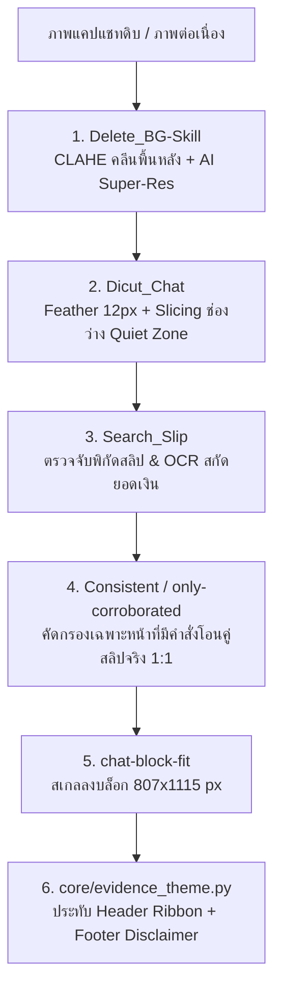

# 💬 SKILL SPECIFICATION: chat-block-fit
## คัมภีร์มาตรฐานการจัดวางหน้าแชทหลักฐานลงบล็อกศาล (Chat-Block Reference Standard: 807 × 1115 px)

> **หัวใจสำคัญ (The Dual-Pillar Evidence Doctrine):**
> ระบบ DIGITAL EVIDENCE แบ่งการจัดวางเอกสารพยานหลักฐานออกเป็น ๒ เสาหลัก:
> 1. **ฝั่งสลิป (`slip-block-fit`):** สเกลบัตรสลิปเดี่ยวลงบล็อก **645 × 890 px** กึ่งกลางหน้า A4
> 2. **ฝั่งแชท (`chat-block-fit`):** สเกลหน้าบทสนทนาแชทลงบล็อก **807 × 1115 px** ชิดขอบบน (Top-Aligned)

---

## 📐 สเปคบล็อกและระยะขอบ (Geometry Specification)

| พารามิเตอร์ | ค่ามาตรฐาน | คำอธิบาย |
| :--- | :--- | :--- |
| **ขนาดหน้ากระดาษ (Canvas A4)** | `993 × 1406 px` | A4 Portrait ที่ 120 DPI ทางการศาล |
| **ขนาดบล็อกเนื้อหา (Chat Block)** | **`807 × 1115 px`** | พื้นที่แสดงผลบทสนทนาสูงสุด (Maximum Content Area) |
| **ระยะขอบซ้าย / ขวา (Margin X)** | `93 px / 93 px` | `993 - (93 * 2) = 807 px` |
| **ระยะขอบบน (Margin Top / Header)** | `133 px` | พื้นที่สำหรับ Header Evidence Ribbon (โลโก้ + MODE + PAGE) |
| **ระยะขอบล่าง (Margin Bottom / Footer)** | `158 px` | พื้นที่สำหรับคำเตือนทางกฎหมาย 3 บรรทัด ฟอนต์สารบรรณ |
| **พิกัดการแปะบน A4 (Paste Origin)** | `x = 93, y = 133` | จัดวางชิดขอบบนบล็อก (Top-Aligned) เพื่อความต่อเนื่องของแชท |

---

## 🔄 วงจรร้อยเรียง ๔ สกิล (The 4-Skill Orchestration Pipeline)



### ๑. ขั้นตอนที่ ๑: คลีนพื้นหลัง (`Delete_BG-Skill`)
- ลบลวดลายวอลเปเปอร์หรือลายน้ำรบกวนสายตาด้วยเทคนิค CLAHE (Contrast Limited Adaptive Histogram Equalization)
- ทำ AI Super-Resolution (EDSR) ขยายพิกเซลให้ข้อความคมชัดระดับพิกเซล

### ๒. ขั้นตอนที่ ๒: ตัดแบ่งท่อนบทสนทนา (`Dicut_Chat`)
- ตรวจจับช่องว่างระหว่างข้อความ (Quiet Zone) เพื่อหั่นภาพ ไม่ตัดผ่ากลางบับเบิ้ลข้อความ
- เชื่อมต่อรอยต่อแนวดิ่งด้วย Feather Blend Seam 12 แถวพิกเซล

### ๓. ขั้นตอนที่ ๓: ตรวจจับสลิปในบทสนทนา (`Search_Slip`)
- สแกนหาขอบเขตพิกัดสลิปโอนเงินที่ฝังอยู่ในหน้าแชท
- OCR สกัดยอดเงิน วันที่ เวลา และเลขที่อ้างอิง

### ๔. ขั้นตอนที่ ๔: คัดกรองความสอดคล้องแห่งคดี (`Consistent` / `only-corroborated`)
- กรองบทสนทนาทั่วไปทิ้ง 100% คัดเฉพาะหน้าที่มีข้อความตกลงกู้ยืม/สั่งโอนเงินคู่กับสลิปจริง

### ๕. ขั้นตอนที่ ๕: บรรจุลงบล็อกมาตรฐาน (`chat-block-fit`)
- สเกลภาพบทสนทนาลงบล็อก **807 × 1115 px** ตามอัตราส่วนเดิม (Aspect-Ratio Lock)
- จัดวางชิดบน `(x=93, y=133)` บนหน้ากระดาษ A4

---

## 💻 อัลกอริทึมใน `core/evidence_theme.py` (SSOT)

```python
def fit_chat_block(chat_pil: Image.Image, target_w: int = 807, target_h: int = 1115) -> Image.Image:
    """
    Fits any sliced chat evidence page into the fixed reference block (807 x 1115 px),
    scaling proportionally to touch width or height, locked at top-align.
    """
    w_orig, h_orig = chat_pil.size
    if w_orig <= 0 or h_orig <= 0:
        return Image.new("RGB", (target_w, target_h), (255, 255, 255))

    scale = min(float(target_w) / float(w_orig), float(target_h) / float(h_orig))
    w_new = max(1, round(w_orig * scale))
    h_new = max(1, round(h_orig * scale))

    resized = chat_pil.resize((w_new, h_new), Image.Resampling.LANCZOS)
    
    # Horizontal center, Top-aligned (y=0)
    x = (target_w - w_new) // 2
    y = 0

    block_canvas = Image.new("RGB", (target_w, target_h), (255, 255, 255))
    block_canvas.paste(resized, (x, y))
    return block_canvas
```

---

## 🚫 ข้อห้ามเด็ดขาด (Prohibitions)
1. **ห้ามยืดภาพ (No Geometric Distortion):** ต้องรักษา Aspect Ratio ของภาพแชท 100%
2. **ห้ามตัดผ่ากลางบับเบิ้ลข้อความ (No Splitting Bubbles):** การหั่นแชทต้องผ่าน Quiet Zone เสมอ
3. **ห้ามละเลย Header/Footer:** หน้ากระดาษทุกหน้าต้องมี Header Ribbon และคำเตือน 3 บรรทัดฟอนต์สารบรรณ
