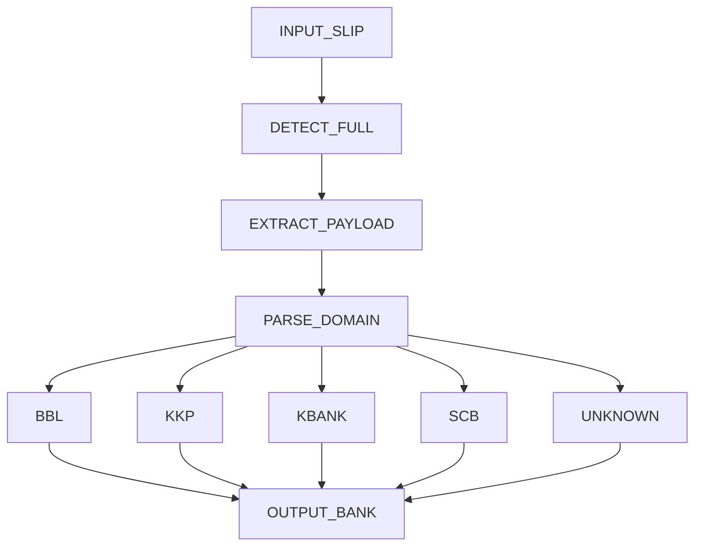

# qr-slip-decoder

## When to use
- ผู้ใช้ขอระบุธนาคารจากสลิป / สแกน QR สลิป / ถอด QR payload

## Workflow (ห้ามข้าม/ห้ามเพิ่มเงื่อนไข)
1. **DETECT** สแกนทั้งภาพหา Finder Patterns (frontend: `@zxing/browser`, backend: ZXing `MultiFormatReader`) — ห้าม crop มุมตายตัว
2. **EXTRACT** ถอดเป็น string — ต้องเป็น URL ตรวจสอบสลิป (ITMX e-Slip)
3. **PARSE** เทียบ domain ตามตารางเท่านั้น

## Decision Table (7 แถว)
| R1 ว่าง/เบลอ/บัง | UNKNOWN/QR_UNREADABLE |
| R2 ไม่ใช่ http(s) URL | UNKNOWN/INVALID_PAYLOAD |
| R3 `bangkokbank.com` | BBL |
| R4 `kkpfg.com` / `kiatnakin.co.th` | KKP |
| R5 `kasikornbank.com` | KBANK |
| R6 `scb.co.th` | SCB |
| R7 domain ไม่อยู่ใน mapping | UNKNOWN/UNMAPPED_DOMAIN |

## Prohibitions
- No Fixed Cropping / No Color Segmentation / No Text-Only OCR trust

## References (source of truth ตัวเดียวกัน)
- `frontend/lib/classifier.ts` — `identifyBank()` (Next.js 15)
- `backend/src/main/java/com/slipdecoder/BankDomainClassifier.java` — `identify()` (Spring Boot 3 / Java 17)
- `backend/src/main/java/com/slipdecoder/SlipController.java` — `POST /api/slip/identify`
- `frontend/app/page.tsx` — UI สแกนทั้งภาพ

## Quick CLI (zero-dep, logic เดียวกัน)
```bash
python scripts/identify.py "https://verify.scb.co.th/slip/999"
# SCB (DOMAIN_MATCH:verify.scb.co.th)
```

## Verify
```bash
npx vitest run --reporter=verbose
```


