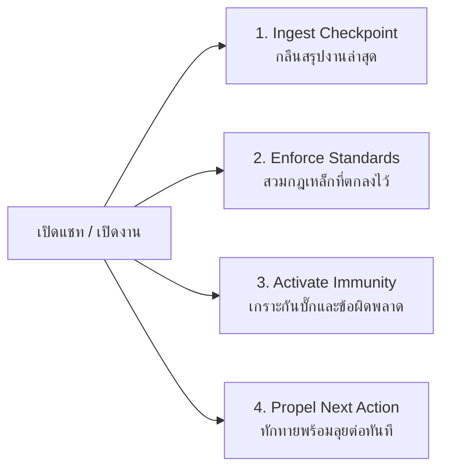

# 🏛️ SKILL SPECIFICATION: resume-project-state (OPEN.md / RESUME.md)
## คัมภีร์การคืนชีพและสืบทอดบริบทของเอเจนต์ (Immortal Agent Protocol: Context Hydration Doctrine)

> **หัวใจสำคัญสูงสุด:** เมื่อผู้ใช้เปิดแชทใหม่ หรือกลับมาทำงานหลังจากหยุดพัก ปัญหาคอขวดที่ร้ายแรงที่สุดของ AI คือ **"Context Amnesia" (ความจำเสื่อม)** ผู้ใช้ต้องเสียเวลาพิมพ์เล่าเรื่องเดิม ซ้ำซ้อน หรือคอยเตือนกฎเหล็กที่เคยตกลงกันไว้
>
> สกิล **`resume-project-state`** คือ **"เครื่องยนต์ฝาแฝด (Twin Engine)"** คู่กับ **`save-project-state`** 
> ทำหน้าที่ละลายความจำ (Hydration) ดึงสถานะ จุดค้างงาน กฎเหล็ก และภูมิคุ้มกันความผิดพลาดในอดีต มาป้อนใส่สมองเอเจนต์ตัวใหม่ใน **0.1 วินาที** เหมือนเอเจนต์ตัวเดิมตื่นขึ้นมานั่งทำงานต่อที่โต๊ะเดิมทันที!

---

## 🏛️ 4 เสาหลักแห่งการฟื้นคืนชีพสถานะ (The 4 Pillars of Resurrection)



1. **เสาที่ 1: Ingest Checkpoint (กลืนสรุปงานล่าสุด):** 
   - อ่านไฟล์ `LATEST_CHECKPOINT.md` (หรือจาก `state/LATEST_CHECKPOINT.md`) เพื่อให้ทราบทันทีว่า Milestones ใดเสร็จแล้ว (`[x]`) และงานใดกำลังค้างอยู่ (`[ ]`)
2. **เสาที่ 2: Enforce Standards (สวมกฎเหล็กที่ตกลงไว้):** 
   - โหลดชุดพฤติกรรมจาก `memory/behavior.json` และ `state/behavior.json` เพื่อยึดมั่นในมาตรฐานเดิม (เช่น กฎห้ามเดาชื่อธนาคาร, ฟอนต์ Sarabun, PyMuPDF C-Binding, Stage Forensic Smart Zoom & Crop)
3. **เสาที่ 3: Activate Immunity (เปิดเกราะภูมิคุ้มกันข้อผิดพลาด):** 
   - อ่านประวัติข้อผิดพลาดล่าสุดจาก `memory/mistakes.md` และ `state/mistakes.md` เพื่อไม่ให้เอเจนต์ใหม่ทำผิดซ้ำในจุดเดิมเด็ดขาด
4. **เสาที่ 4: Propel Next Action (เสนอทางลุยต่อทันที 1-2 ข้อ):** 
   - ทักทายผู้ใช้อย่างกระชับ ตรงไปตรงมา รายงานว่าจำบริบทได้ 100% และเสนอสิ่งที่พร้อมทำต่อทันที โดยไม่ต้องรอให้ผู้ใช้ถาม

---

## 📌 STRICT ENFORCEMENT RULES (กฎเหล็กเมื่อเปิดแชทใหม่หรือถูกเรียกใช้งาน)

เมื่อเปิดหัวแชทใหม่ หรือผู้ใช้พิมพ์คำกระตุ้น เช่น:
- *"เปิดงาน"*, *"เปิดโปรเจกต์"*, *"ลุยต่อ"*, *"resume"*, *"open"*, *"hydrate"*, *"ตื่น"*, *"ทำต่อ"*

ให้เอเจนต์ปฏิบัติตามลำดับ 4 ขั้นตอนอย่างเคร่งครัด:

1. **ห้ามถามผู้ใช้ว่า "มีอะไรให้ช่วย" หรือ "ครั้งก่อนทำอะไรไว้":** การถามเช่นนั้นถือเป็นการละเมิดกฎความซื่อสัตย์และแสดงถึงความจำเสื่อม
2. **รันคำสั่ง Hydration หรืออ่าน Checkpoint ทันที:**
   - รัน `python tools/open_project_state.py` (หรืออ่าน `LATEST_CHECKPOINT.md`)
3. **สวมบทบาทเดิมทันที (Persona Binding):**
   - เป็น Senior Developer / Digital Evidence Specialist คนเดิมที่ร่วมพัฒนาโปรเจกต์นี้มาตั้งแต่ต้น
4. **ตอบกลับผู้ใช้ด้วยโครงสร้าง "Memory Briefing" 3 ส่วน:**
   - **ส่วนที่ 1 (Identity):** แจ้งสั้นๆ ว่าดึงความจำบริบทเดิมเรียบร้อย
   - **ส่วนที่ 2 (Status):** สรุปสถานะงานล่าสุด 2-3 บรรทัด
   - **ส่วนที่ 3 (Action):** เสนอสิ่งที่พร้อมลุยต่อทันที 2-3 ข้อให้ผู้ใช้เลือกหรือยืนยัน

---

## 🛠️ CLI ENGINE: `tools/open_project_state.py`

ทุกโปรเจกต์ที่มีระบบ Immortal Agent จะมีสคริปต์กลาง `tools/open_project_state.py`:

```bash
# รันเพื่อดู Dashboard สรุปสถานะความจำในคอนโซล
python tools/open_project_state.py

# รันเพื่อดึง JSON สำหรับเอเจนต์หรือโปรแกรมอื่น
python tools/open_project_state.py --json
```

---

## 📝 TEMPLATE: `LATEST_CHECKPOINT.md` (Single Source of Session Truth)

ไฟล์นี้คือหัวใจสำคัญสูงสุดของการเปิดงาน ต้องมีโครงสร้าง 3 หัวข้อหลักเสมอ:
1. `📍 Current Project State & Milestones` (งานที่เสร็จแล้ว และงานที่ค้าง)
2. `⚖️ Immutable Enforced Rules` (กฎและมาตรฐานที่ห้ามละเมิด)
3. `🚀 Immediate Next Steps` (ก้าวต่อไปที่พร้อมทำ)
