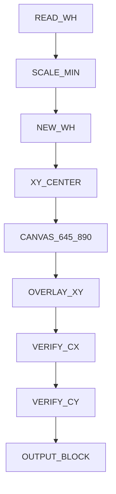

# slip-block-fit

## When to use
- จัดวางสลิปลงบล็อกหลักฐาน 645x890 / วางกึ่งกลาง / fit ไม่บิดเบี้ยว

## Workflow (5 ขั้น)
1. อ่าน `Worig,Horig`
2. `Scale = min(1, min(645/Worig, 890/Horig))` — `min(1,..)` คือ Small Image Bypass (เล็กอยู่แล้วห้ามขยาย)
3. `Wnew=round(Worig*Scale)`, `Hnew=round(Horig*Scale)`
4. `x=floor((645-Wnew)/2)`, `y=floor((890-Hnew)/2)` → center ตรวจได้ `(322.5,445)`
5. สร้าง canvas 645x890 (สีพื้นจาก pixel มุมสลิป) แล้วแปะที่ `(x,y)`

## Decision Table
| R1 ภาพใหญ่ | ย่อ ไม่ล้น 645x890 |
| R2 เล็กกว่า (500x700) | Scale=1 ไม่ขยาย |
| R3 ตรง 645x890 | x=0 y=0 |
| R4 ทุกเคส | Wnew<=645 Hnew<=890 |
| R5 ทุกเคส | x+W/2=322.5 y+H/2=445 (±1px จากปัด integer เมื่อผลต่างเป็นคี่) |
| R6 ทุกเคส | x,y integer (floor) |
| R7 ทุกเคส | Wnew/Hnew ≈ Worig/Horig (no-stretch) |

## Prohibitions
- ห้าม resize ตรง `(645,890)` / ห้าม offset คงที่ / ห้าม margin ซ้าย-ขวาไม่เท่า

## References
- `frontend/lib/fit.ts` — `fitSlip()` (Next.js 15)
- `backend/src/main/java/com/slipfit/SlipFit.java` — `fit()` (Java 17)
- `scripts/fit.py` — CLI ตรงกัน

## Quick CLI
```bash
python scripts/fit.py 1000 1000
# {'newW': 645, 'newH': 645, 'x': 0, 'y': 122, 'scale': 0.645}
```

## Verify
```bash
npx vitest run --reporter=verbose
```

## Production note (แก้บั๊กจากโค้ดตัวอย่าง)
- ตัวอย่างเดิม `edge_color = resized_slip.tolist()` ผิด (ได้ทั้งภาพ) → ใช้ pixel มุม `resized_slip[0,0].tolist()` หรือเฉลี่ยขอบก่อนสร้าง canvas


